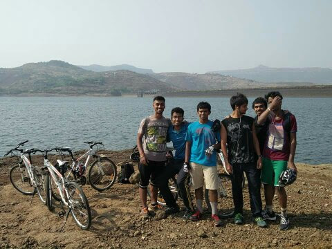
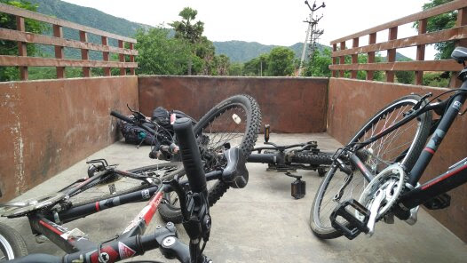
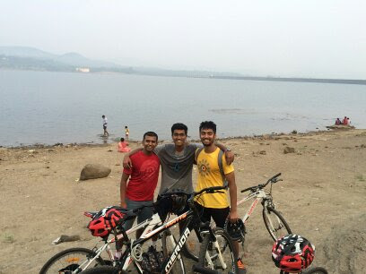
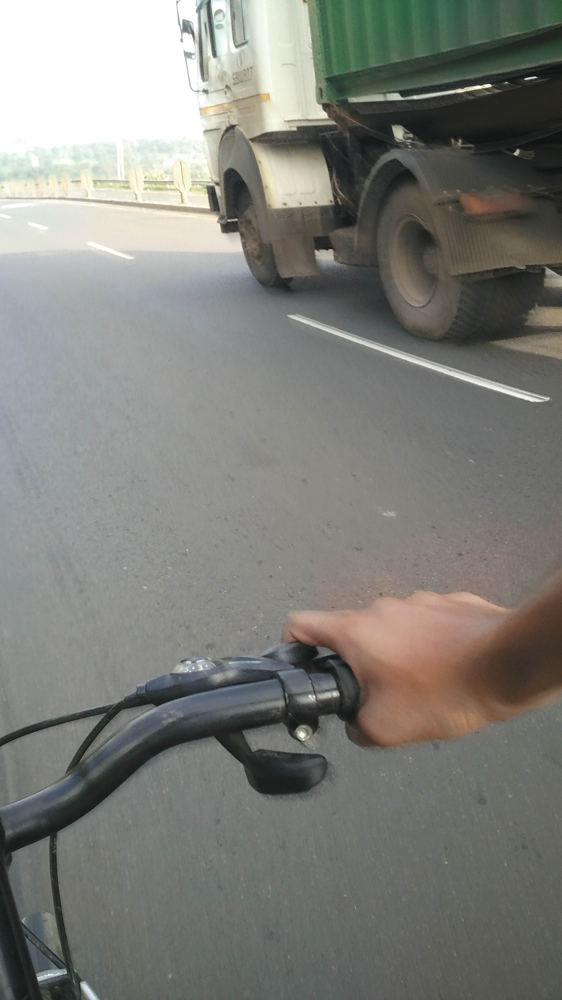
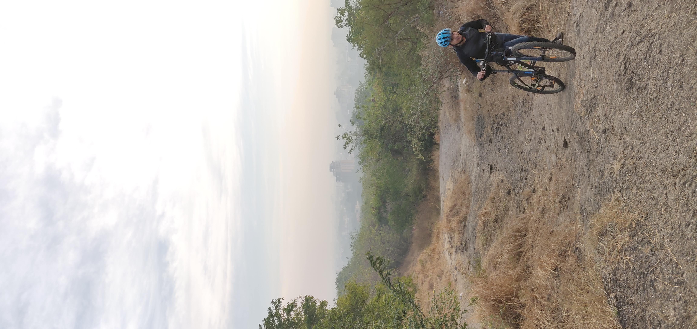

A collection of the crazy things I did:

## Treks around Pune
<iframe src="https://uploads.knightlab.com/storymapjs/86b641d8dab18249930bd311ff89241c/pune-treks/index.html" frameborder="0" width="100%" height="800"></iframe>
I wanted to try this tool for map storyboarding - <a href="https://storymap.knightlab.com/" target="_blank">StoryMap JS</a> 
These aren't meant to be reviews. If you want my opinion on any of these, do reach out.

Glimpses from cycling:
<!-- 

 -->

<!--  -->


<!-- <ul class="adventures_misc">
    <li>Cycling:</li>
    <ol>
        <li>Pune➡Panshet➡Pune </li> 
        <li>Coimbatore➡Sholayur</li> 
    </ol>
</ul> -->