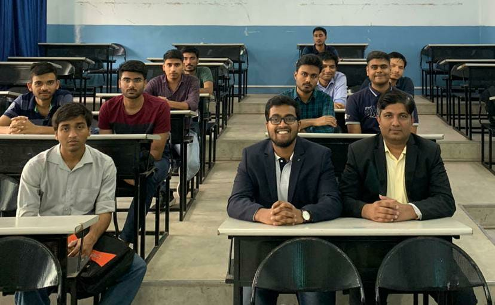

>Credit Suisse, as part of its campus outreach conducts a 3+2 credit finance-technology electives in various colleges.  

As part of this program, I taught macroeconomics to sophomore and junior students from computer science at the <u>Army Institute of Technology</u>. *The best part of this was to go from being a student of this course in 2018 during my senior year at [COEP](https://www.coep.org.in), to being a faculty in 2020 as an employee with the bank*

It was a very enriching experience to learn something new in depth. I had not realised the exponential level of difference in *knowing the syllabus* vs *being able to answer doubts in that syllabus*.

 

I studied a couple of online resources, and most importantly the [NCERT Macroeconomics textbook](https://www.amazon.in/Introductory-Macroeconomics-Textbook-Economics-Class/dp/8174507159) for a month to be confident enough to teach.
  

