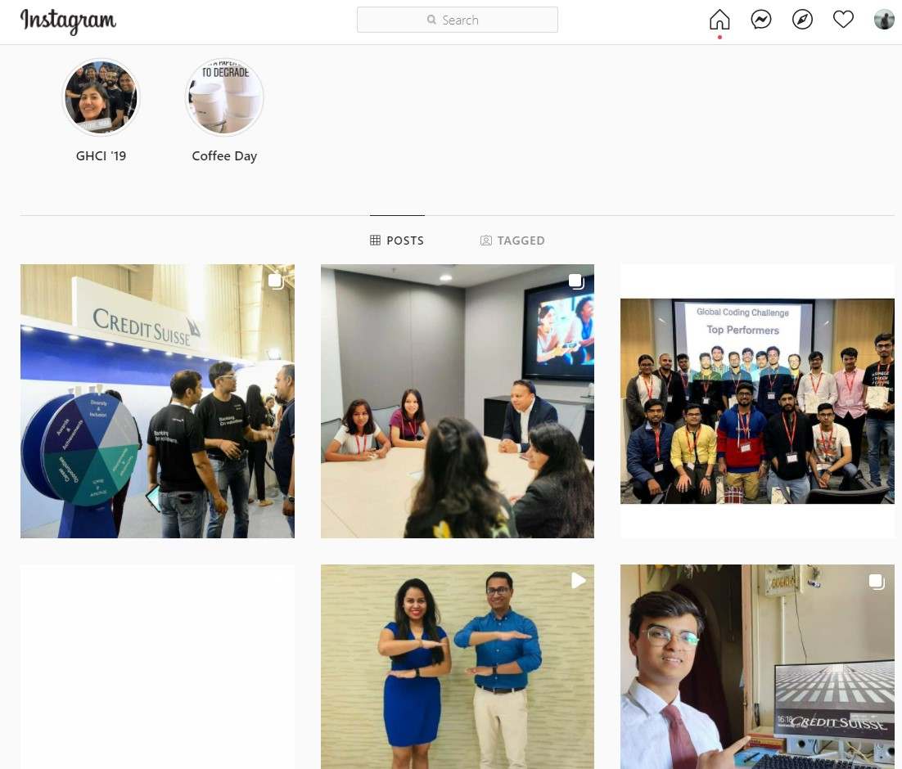
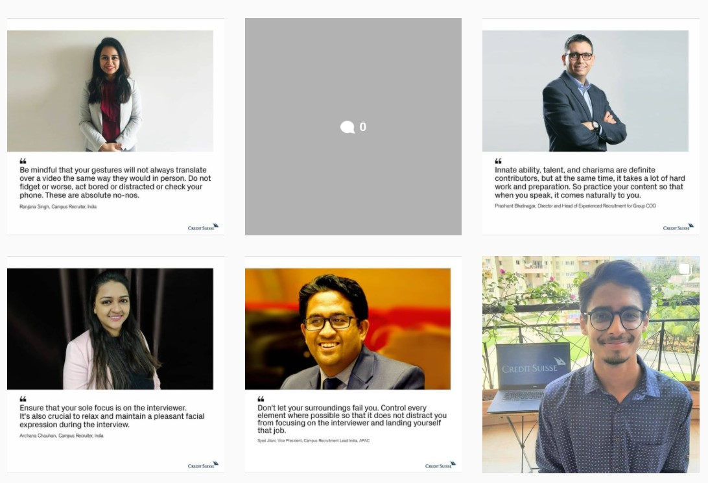
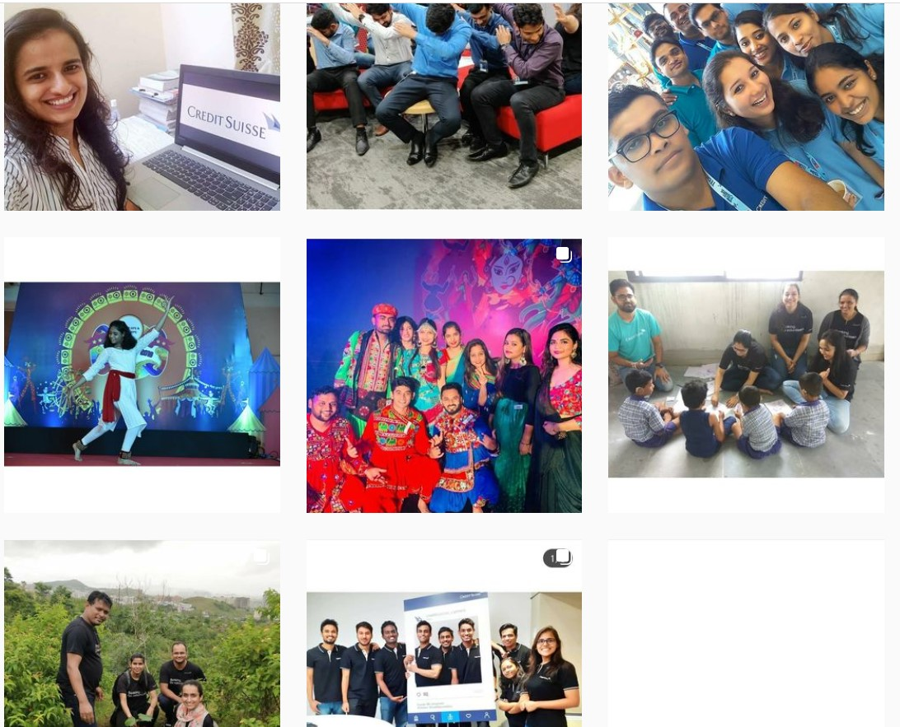

Based on our work with the [creditsuisse_careers global page](https://www.instagram.com/creditsuisse_careers/), Arnab and I thought that we might benefit from a page exclusively for India. After all, we were 8,000 employees spread across 4 cities and 8 offices. We had no dearth of interesting conferences, philanthropy activities, and employee engagement stories to share. As an organisation we were also on a mission to make CS IT India the most preferred recruiter.

<iframe src="https://docs.google.com/presentation/d/e/2PACX-1vQ7ZRajl4ZCMRmCXVj5-U2kV0q2VdOq8N1lKaPIgu8FuHeEtiG7fcNXBE93bCejmbc3eIjs21Z58bmx/embed?start=true&loop=true&delayms=3000" frameborder="0" width="960" height="569" allowfullscreen="true" mozallowfullscreen="true" webkitallowfullscreen="true" width="100%"></iframe>

While our proposal was approved in India, it ultimately did not align with the broader social media strategy of our global organisation. Nonetheless, it was a lot of fun researching and putting this together.

Note - All the data here is publically available. The work is mine, and not meant to represent Credit Suisse or any of its entities in any way. 

Check out the India related posts that we played a part in featuring on the global page since then:

