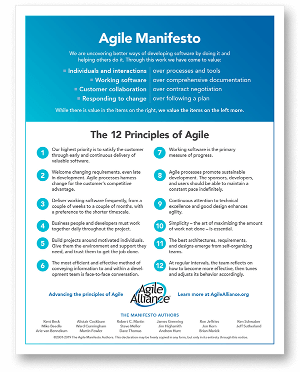
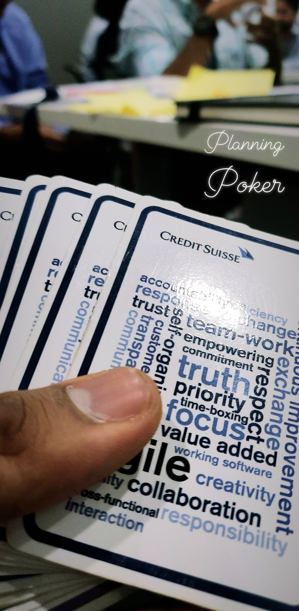

>Credit Suisse, as part of its campus outreach conducts a 3+2 credit FinTech electives in various colleges.  

As part of this program, I taught the principles of the Agile methodology to sophomore and junior students from computer science at my alma matter,  <u>College of Engineering Pune</u>. *The best part of this was to go from being a student of this course in 2018 during my senior year, to being a faculty in 2020 as an employee of the bank*

We covered the need for Agile, asked students to share their own experiences and tried to understand how they could have done their projects better. Then we covered the original Agile manifesto and typical scrum and talked about the variants like SaFE and Kanban.

The class concluded with a game of planning poker simulating sprint planning the features of a stock trading application and a recap form every engineer's favourite show - Silicon Valley.

<iframe width="100%" height="617" src="https://www.youtube.com/embed/Ps4nSgyieIw" title="YouTube video player" frameborder="0" allow="accelerometer; autoplay; clipboard-write; encrypted-media; gyroscope; picture-in-picture" allowfullscreen></iframe>