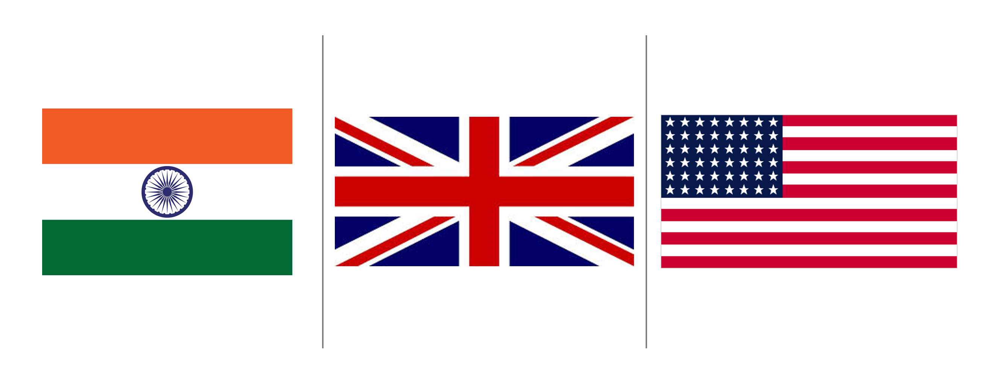
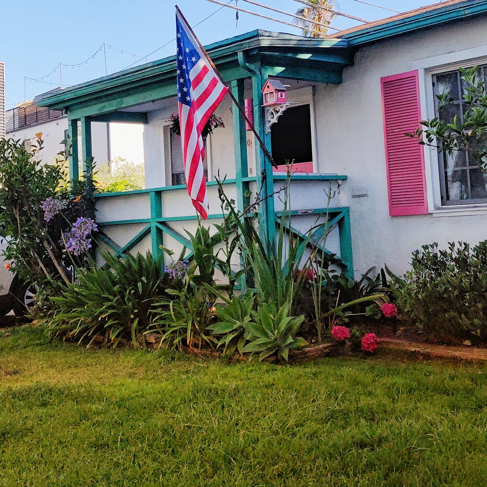
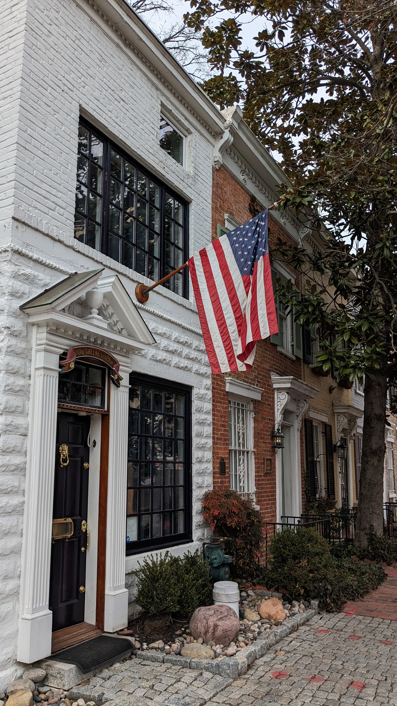
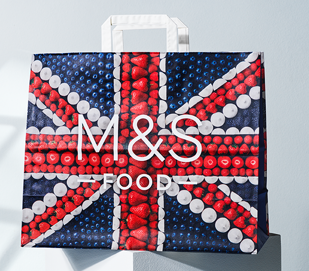
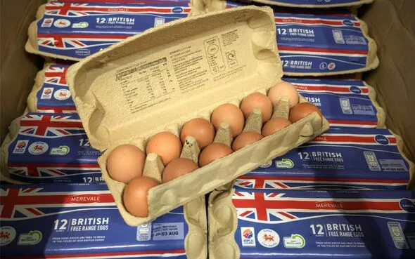

I spent just over 2 weeks in London this summer, a few of those days were detours to Edinburgh in Scotland and Cambridge too. This post is about the omnipresent Union Jack, which reminded me of the Star Spangled Banner in the US, and the tricolor back home. 

{: width="100%"}

When I moved to the US a few years ago, I used to see all the flags on commercial buildings and outside homes and snicker to myself, are you all confused where you are? Why do you need to have so many of your own flags in your own country?

To me, flags outside of a border/goverment institution make sense when there is (1) a split identity and a desire to signal, for instance for residents of Kashmir or Irish flags in Scotland, or (2) Divisive issues, like Israel/Palestine protestors on USC and Cambridge campuses. But neither of these reasons apply for a hotel in LA, a home in San Diego, a supermarket in London, or offices in Boston. Why do they need flags?

{: width="80%"}
{: width="30%"}
{: width="30%"}

In India, where I grew up, flags only came out twice a year - Independence and Republic Day. Apart from that you'd just spot them on goverment buildings if you were observant enough. I grew up in military bases and even there I don't have a recollection of a strong flag culture beyond ceremonial needs.

Its not just buildings in the US where flags lean over sidewalks. If you're out on 4th July in the US, you can spot the star spangled banner on shorts, cupcakes, bikinis, cookies, and clip-on-nails. Placing the Indian tricolour on one's backside would be considered a federal violation ([no, seriously](https://www.mha.gov.in/sites/default/files/flagcodeofindia_070214.pdf)).

Walk through a British supermarket, and you'll find the Union Jack adorning carrots and cauliflower. All proudly made/grown in the UK, take the tube and you'll soon see a M&S bag in someone's hand with a creative flag image fashioned out of blueberries, onions, and strawberries.

{: width="45%"}
{: width="45%"}

So I thought to myself, this might have something to do with living memory of war? The Brits have grown up in post war remains and the US has a much more recent history of (instigating?) and inserting itself in global conflicts. These long international conflicts overshadow India's experience in Kargil, 1962, 1971 etc.

Or is it due to rhetoric and nationalism? A rising global public sentiment. America is not shy of annointing itself the greatest country in the world, and the UK pulled out of the EU (in a spectacular failure). I've been mature enough to watch (and even indulge a bit) in the India's century (thank you [McKinsey](https://economictimes.indiatimes.com/news/economy/indicators/its-not-indias-decade-its-indias-century-says-mckinseys-bob-sternfels/articleshow/93937057.cms)) sentiment finding it's place in the public square chowk. Surprisingly large flags have gone up in Connaught Place in Delhi, near Cubbon Park in Bangalore, and Nigdi in Pune. During Covid we banged pots and pans from our windows to support frontline workers (?), and there have been a surprising number of national pride movies in recent years. So maybe India in a decade will be proudly saffron, white, and green outside every home, on the chai patti boxes, and on the hawker stalls?

> O say can you see, in the dawn's gentle light,  
How it rises with pride through the shadows of night,  
The saffron, the white, and the green so bright,  
Over the land where our spirits are free and our future is bright?  
And the Ashoka Chakra in the center so bold,  
Tells the story of peace and a history untold;  
O say does that triumphant tricolor still wave  
Over the land of the free and the home of the brave?

_My version of the Star Spangled Banner for the Indian tricolor!_

<!-- <iframe width="560" height="315" src="https://www.youtube.com/embed/JwcWgl7vBJs?si=TdUK2JYtAbjQqglB" title="YouTube video player" frameborder="0" allow="accelerometer; autoplay; clipboard-write; encrypted-media; gyroscope; picture-in-picture; web-share" referrerpolicy="strict-origin-when-cross-origin" allowfullscreen></iframe> -->