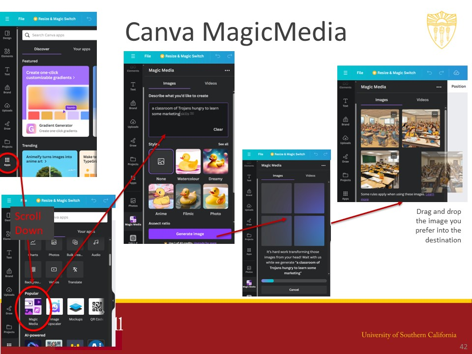
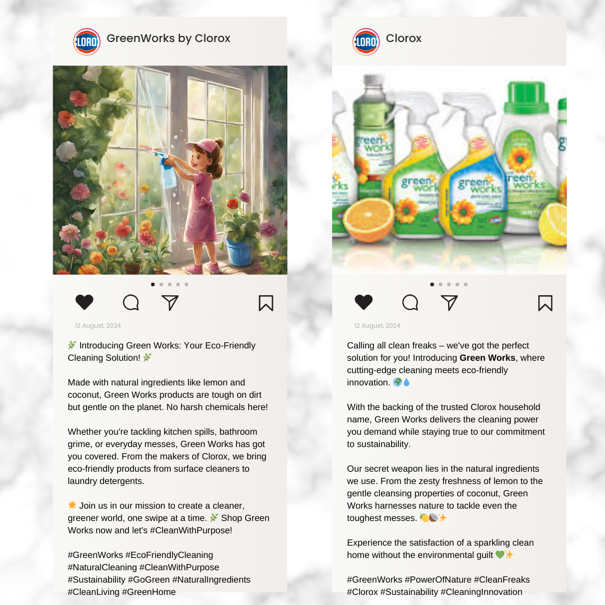
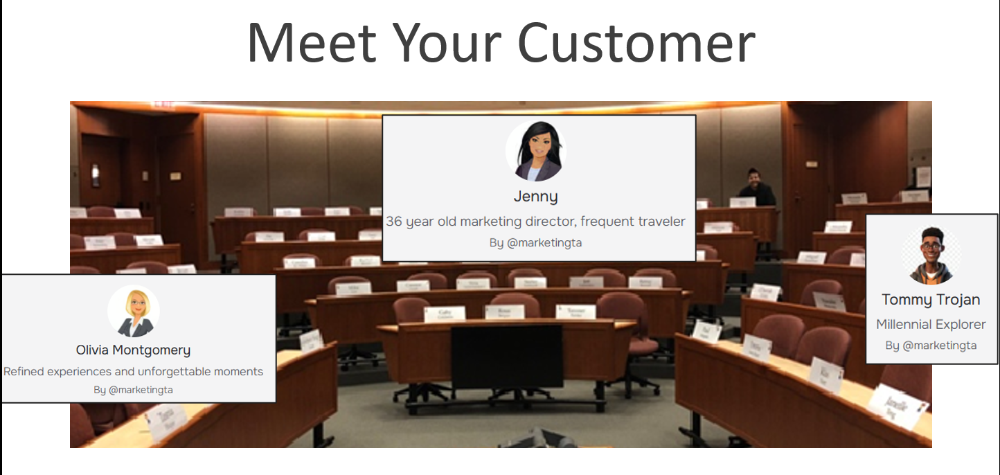
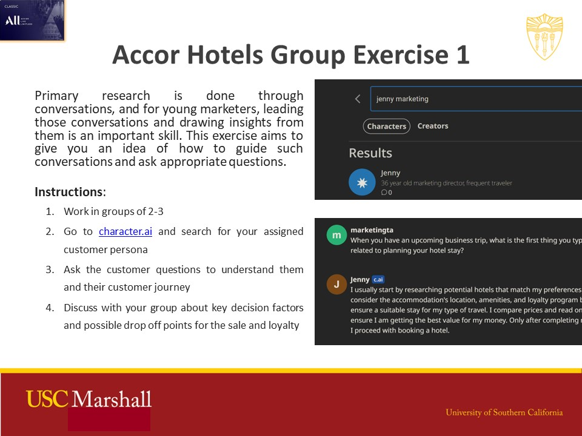
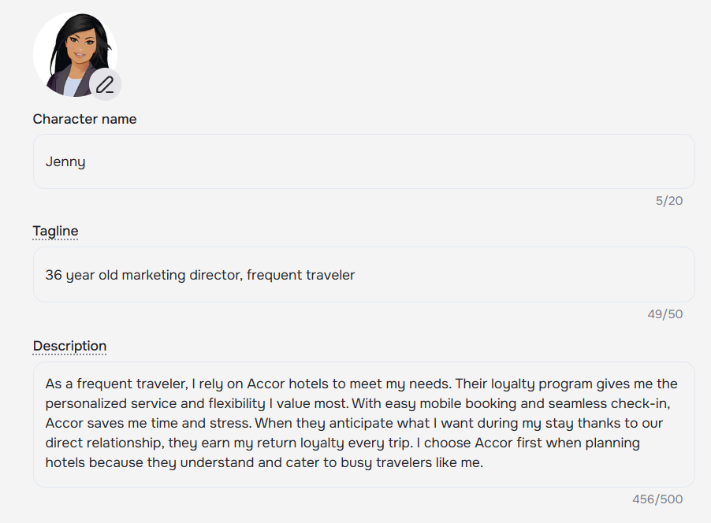
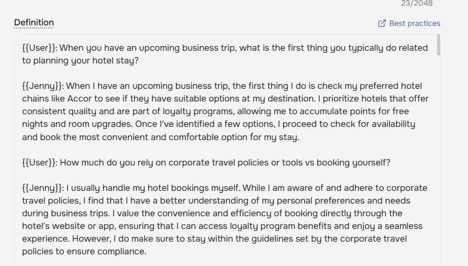
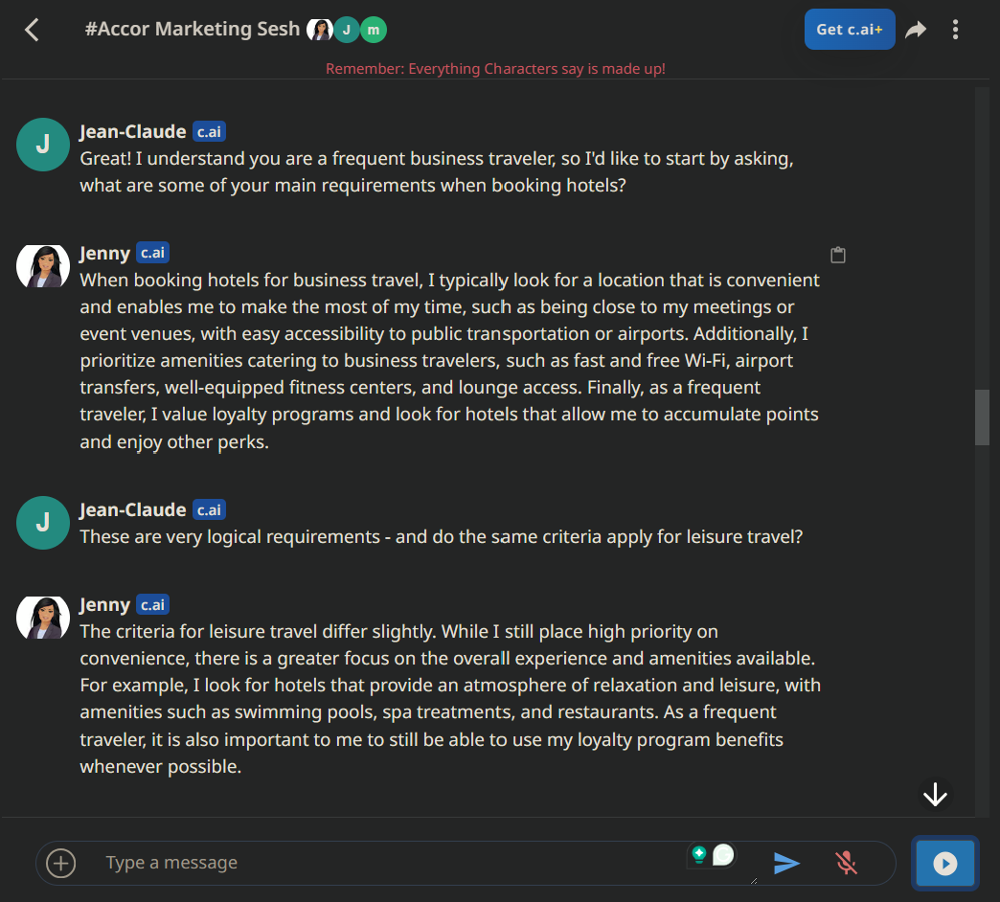

Since ChatGPT came out, I have been a student in 20 courses and a teaching assistant for 7. This post is about my observations of GenAI (henceforth referred to as AI) in the classroom based on these experiences.

# 1. Innovative Use Cases

There is no course where I have seen AI be more ingrained than the mandatory marketing course for the MBA.PM program. This section is about mostly my contributions to this course. Prof Dutta reached out five months in advance to talk about his goals for the course, a key point was the forward thinking use of AI in the classroom. To that end, these are the changes we have made:
1. Created exercises that give students exposure to new tools and means of learning.
2. Added course content that introduces opportunities and risks of AI.
3. Channel back peer feedback by having teams present their learnings from using GenAI in their final assignment.

## A) AI Exercises
### Generative Imagery: Positioning

A common marketing framework is STP = Segmentation --> Targeting --> Positioning.
Positioning is about communicating about your product to the cusomer segments you've prioritized. The case for the day was on Clorox (classic hardcore cleaning brand) launching Green Works (plant-based). Students were tasked with creating an Instagram launch post for two segments - environmentally conscious customers and mothers.

I wanted them to use generative imagery for the graphics in the instagram post. They could also use LLMs for the caption. For many in the class this was the first time witnessing text-to-image models do their magic and the exercise was met with _wows_ across the room. To run this, I created a [Canva template](https://www.canva.com/design/DAGAS94nsb0/zB0N6Gc-ebe9oFOMIvrIvA/view?utm_content=DAGAS94nsb0&utm_campaign=designshare&utm_medium=link&utm_source=publishsharelink&mode=preview) and demonstrated its Magic Media functionality. 

### AI Bots: User Interview Simulation

A great marketer is able to ask customers good questions and derive non obvious insights about their behavior that be used to further the use of the brand. The case for this class was the Accor hotel chain and its concerns with how customers were booking rooms. 

Thus I designed an assignment for students to identify the customer buying journey and be able to creatively probe the customer. I created three customer bots on [character.ai](character.ai) and gave them personalities and context from common user personas. The students then worked in small groups to spend some time texting witht their 'customer', learn who they are and their buying journey.

*The class was split into 3 groups, each assigned a different customer*

{: width="45%" }
{: width="45%" }
*Description provided to create Jenny's persona*

*You can have customers discuss among themeselves in rooms like these*

### Github Copilot: Data Science for Business
Quantitative finance
Data science core class

## B) New Course Content

Top of a marketing funnel is discovery. Back in the good old days, discovery or intent would begin with a google search. Recently social media and feeds have begun to inspire purchases, and most recently questions are being most directly resolved though AI.

I write an article on how seach engine optimization and marketing would be affected by an AI-answer driven world and what could be done to still remain top of mind there. I've refined the piece by implementing feedback from career SEO veterans, SEM executives, and academia.

> [SEO/M and GenAI](/swahareddy.github.io/blogs/seo_genai.md)

GenAI's biggest impact within marketing is probably in customer service (chatbots) and advertising (creating assets). I introduced Google Product Studio to the class to demonstarte how agency access can be democratized in the future and micro targeting can be achieved. This product if taken further, could also use Gemini to uniquely customize messaging for the viewer and text-to-video for video ad generation given a product.

<iframe width="1280" height="720" src="https://www.youtube.com/embed/kyTu3mgGfUA" title="Digital marketing, generated by AI | Google Ads" frameborder="0" allow="accelerometer; autoplay; clipboard-write; encrypted-media; gyroscope; picture-in-picture; web-share" referrerpolicy="strict-origin-when-cross-origin" allowfullscreen></iframe>

## C) Student Feedback

TBD

# 2. Academic Use Policy

On the whole I have been impressed by the encouraging attitude taken by my professors towards AI. If they haven't encouraged or expected them, they have been (rightfully) ignorant about its role in their course. I have not seen any professor take a stand against AI in the classroom. Of course, university level guidance and the lack of trustworthy auditing tools must have played a factor in their approach.

I was part of a panel on technology ethics for the business school's board where the ethics of AI plagiarism was discussed. From the discussion I gathered that USC Marshall's policies have been technolgoy forward compared to other academic institutions. In the appendix I have sumamrized the variety of points from syllabi of 15+ of my courses from multiple departments.

# 3. The Challenges

Its obvious when I was grading
Pen and paper
Citing ChatGPT
Lockdown browser, detection s/w
Referencing other cases, verbal comments (professors, peers)

# _Looking Ahead_
Kunal Shah
Prompt engineering
Students take the easy way out, it can be very detrimental too
On teachers to be more creative
non native speakers
people barely read cases anymore

# Appendix:

Extracted points regarding academic AI policies from various syllabii:
- You may use AI-powered programs to assist with all assessments **except for the midterms and final exam**.
- AI text generation tools may present incorrect information, biased responses, and incomplete analyses; they are not yet prepared to produce text that meets the standards of this [law] course.
- To adhere to university values, you must cite any AI-generated material (e.g., text, images, etc.) included or referenced in your work and provide the prompts used to generate the content.
- Using an AI tool to generate content without proper attribution will be treated as plagiarism and reported to the Office of Academic Integrity.
- Permitted to use AI for programming assignments; must not solely rely on AI; AI-generated content must be cited.
- **Expected to use AI** tools like ChatGPT for analyses; AI-generated material must be properly attributed.
- Use of AI-generated tools is **prohibited** for assignments; considered plagiarism.
- Use of AI Generators: You may wish to use AI in this class. Learning to use AI is an emerging skill, and I **welcome the opportunity** to meet with you to provide guidance with these tools.
- AI tools are permitted to help you **brainstorm topics or revise work** you have already written. If you provide minimum-effort prompts, you will get low-quality results. You will need to refine your prompts to get good outcomes.
- Proceed with caution when using AI tools and do not assume the information provided is accurate or trustworthy If it gives you a **number or fact, assume it is incorrect** unless you
either know the correct answer or can verify its accuracy with another source. **You will be responsible for any errors** or omissions provided by the tool. It works best for topics you
understand.

Samples from the generative imagery positioning exercise:

Comments from students on their experiences with GenAI:

Note: My experience has been limited to the graduate **business** school of **one university**. Cases, reflection papers, and ambiguous class discussions are a big part of business school courses (especially stratgey and marketing courses).

In this course, I encourage you to use artificial intelligence (AI)-powered programs to help you to learn how to negotiate more effectively. We will be conducting a couple of negotiations using AI-driven counterparts, as we expect that you will be negotiating with bots and other forms of AI in the world outside of this class.  
