I recently read Nir Eyal's book- **Hooked: How to build habit-forming products**
<!-- https://www.slideshare.net/nireyal/the-secret-psychology-of-snapchat -->

And as a self-assigned homework assignment, I wanted to analyse 'stories' from the *hooked* perspective. Their growth

Just to get everyone on the same page, what I mean by stories is this:

**Instagram:**   
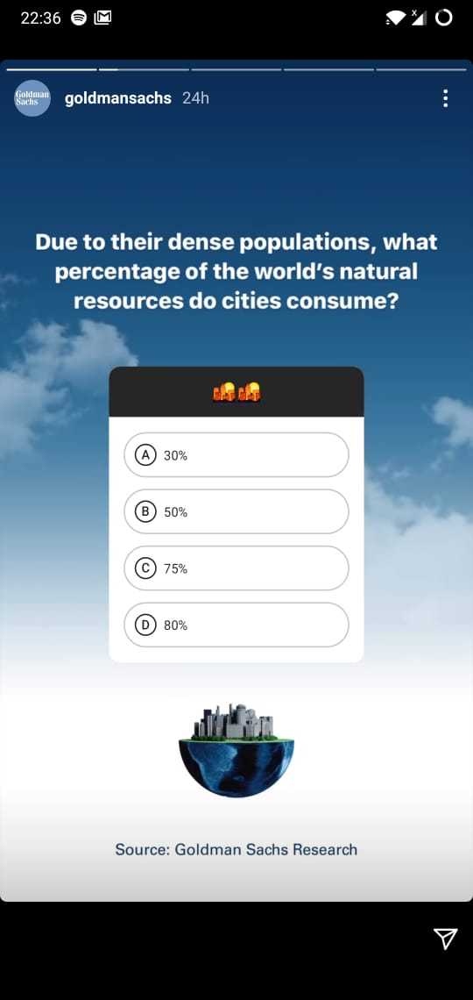{: width="30%" }
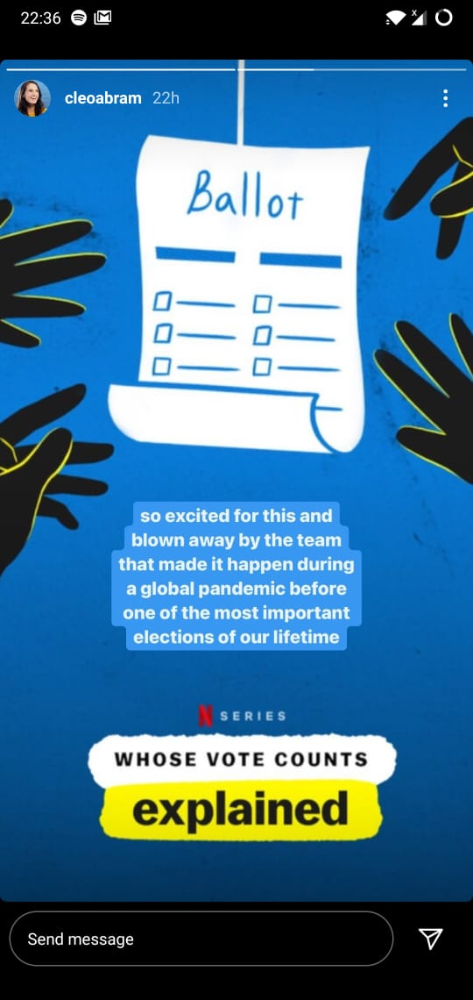{: width="30%" }
{: width="30%" }

There are a lot more platforms*, Facebook, Whatsapp and YouTube being other visible examples. Even Skype and Medium apparently have their versions of it and LinkedIn is recently launched it too. They have various names - fleets, snaps, statuses and reels, but I'll be using 'story' as a broad name for them all. 

So how would you define a *story*? This definition of course differs among different platforms, and even within the same platform, the way public and DM stories (for example) work are different. 

>A full-screen appearance on content with ephemeral presence and an expiry time (usually 24h).

But breaking down just the essentials:
1. **Full screen** A pretty simple feature, but one that has the most value. Unlike a post that is packed inside the app's UI which is already inside the OS's UI, stories take advantage of almost 2x real estate on your screen. And this captures *all of your attention* .

2. **Ephemeral presence**. The story once opened disappears. If its a public story it fades back into the story rack and if its a DM story, it can even disappear for ever. Why is this good? Because again you have *all their attention*. Checking stories demands a certain engagement which simply is not there when someone is casually running through their wall.
   Note! This is different from the *expiry* talked about next. This can be possibly be explained by the heuristic of **Scarcity effect** which says that the *appearance of scarcity affects the perception of value* (Click on the cookie to see the actual experiment [🍪](https://rochemamabolo.wordpress.com/2016/10/28/creating-scarcity-cookie-jar-experiment/))

3. **Expiry**. From a user behavior perspective, this was a gamechanger. Even today, stories are primarily visual content. And stories offered a way of sharing (your images) with your network **without the anxiety** of chasing perfect images, filters and captions that was common with existing apps like Instagram. Of course the quality of stories has since matured, but it's still **distinctly more honest** than posts. 
 And Instagram *highlights* now lets you catalog your stories too, so the good stories can be made permanent if you wish to do so.

Not just consumers, but stories have been amazing for brands too. The real-time engagement that you would earlier have had only on slowly aging Facebook or intellectual twitter is now possible on Instagram too, especially important since Instagram and Snapchat are clear winners in the 21-40 age demographic. 

Where else would brands find such genuine free publicity? These would have never made it to '*posts*' that are well guarded.
 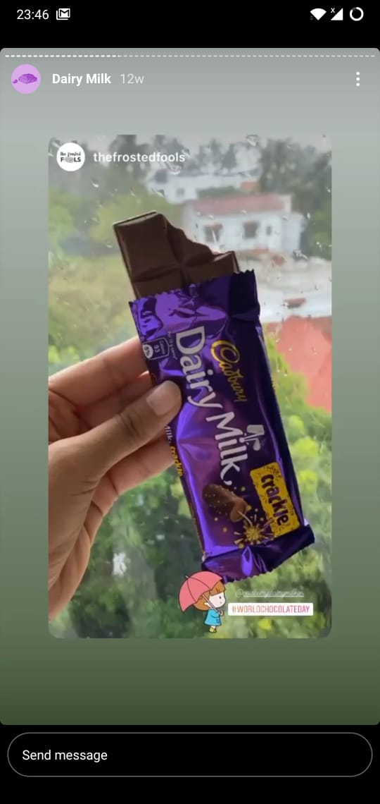{: width="70%" }

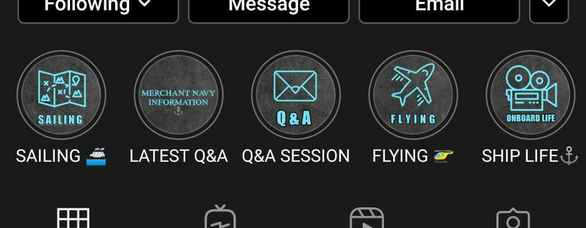{: width="80%" }

# Now what is this 'Hooked' model?
Its a model of how habits (or addictions) can be created, explained in (although not limited to) a technological context. This has been created by Nir Eyal, an industry veteran, author and lecturer who's work is a part of BSchool curriculums. You can find the preview and purchase link for the book [here](books2020.html)!

 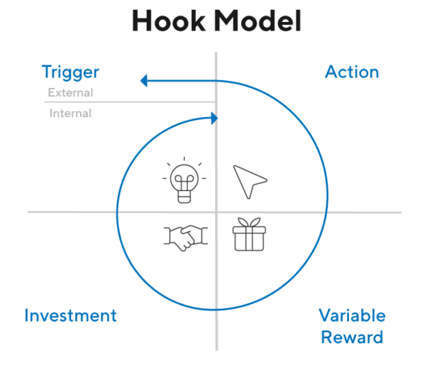{: width="80%" }

## 1. Trigger
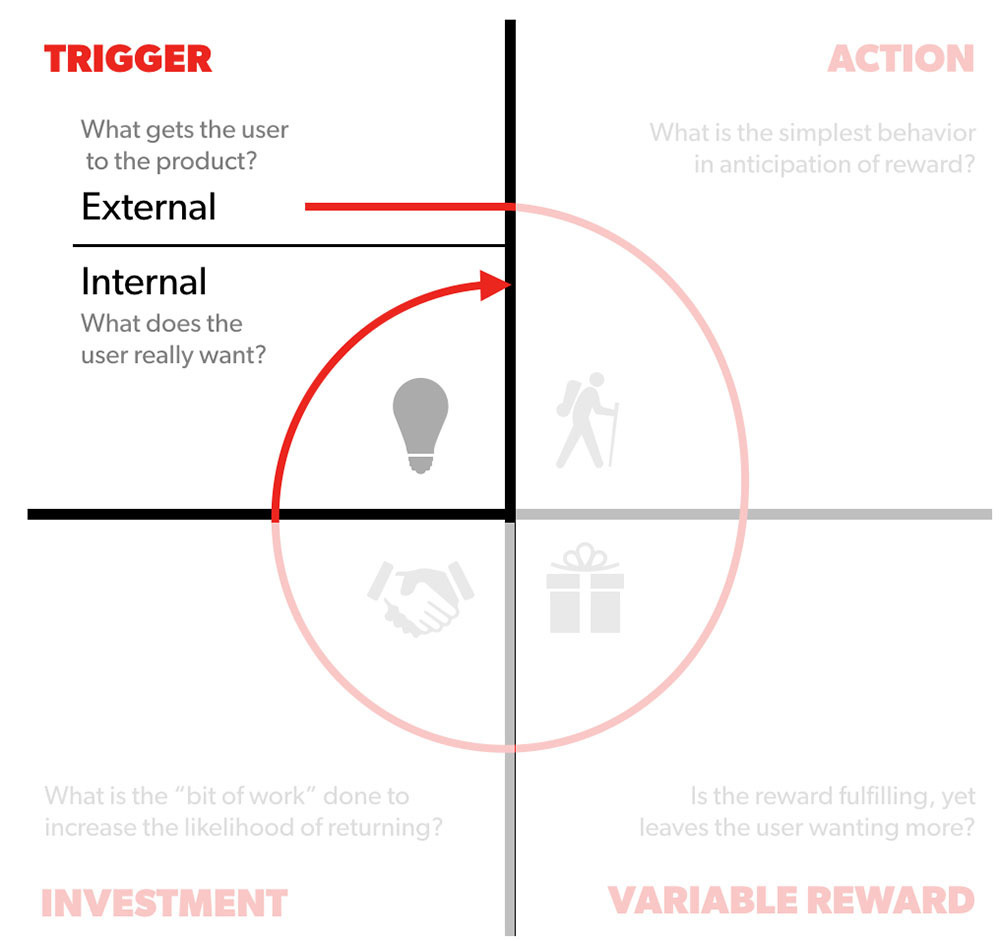{: width="80%" }

Triggers can be :
* **External** - Notifications are the most obvious. Yes, the ones that say 'Tejaswa mentioned you in a story' and 'TanmyaBhatt is now live' are direct triggers for stories. But more than that, I believe the placement of stories in the app's UI is the most effective external trigger. They get prime real estate at the top of the app's home page and you're also reminded in between your non-story usage of that application.

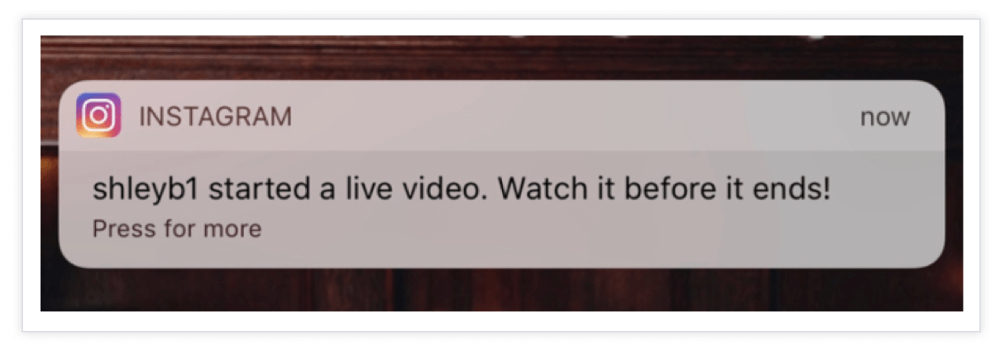{: width="60%" }

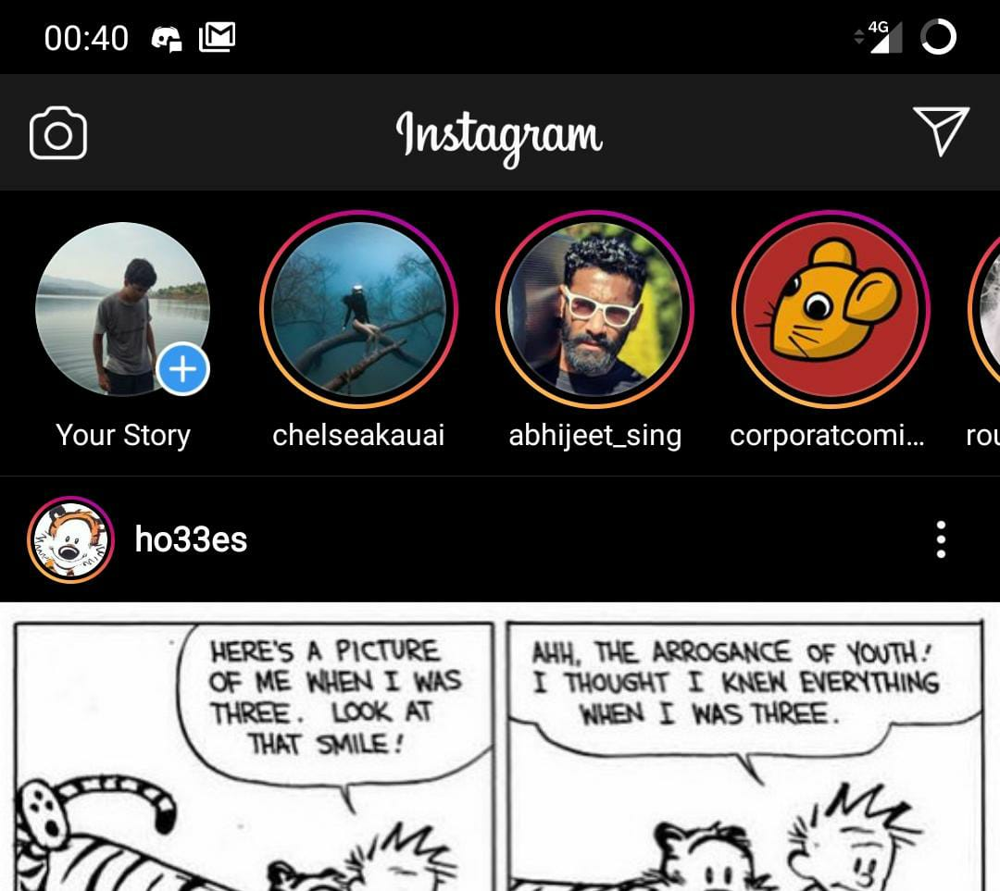{: width="40%" }
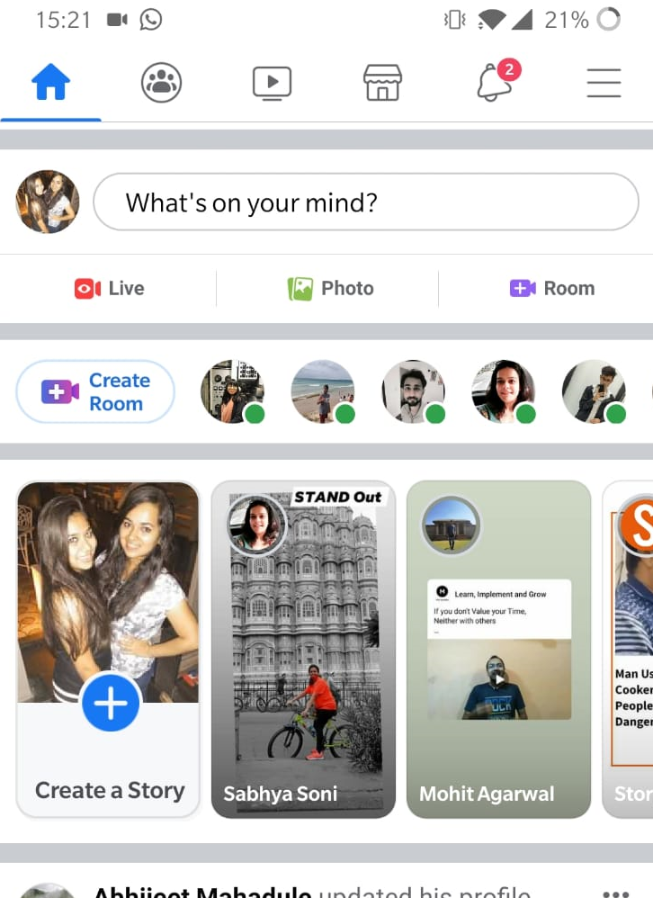{: width="40%" }

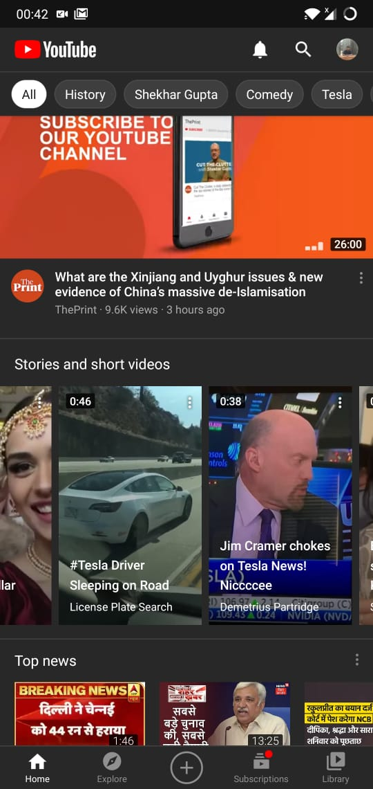{: width="35%" }
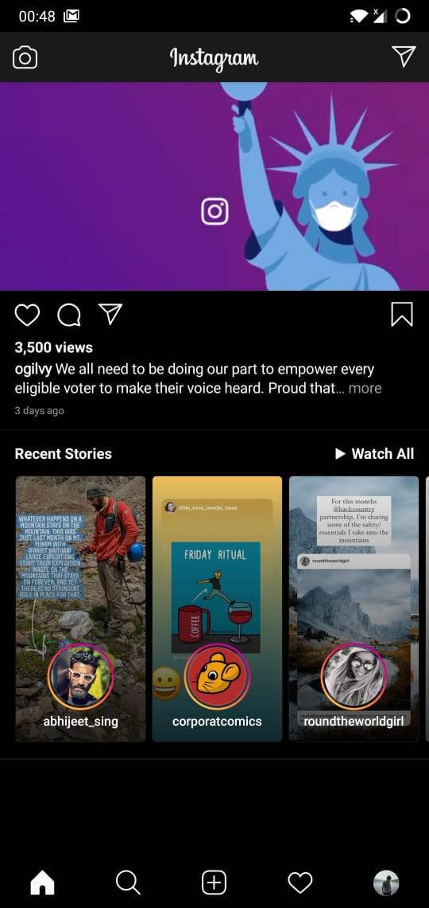{: width="35%" }
{: width="12%" }

* **Internal** - Snapchat set the trend. You open the app not on a *feed* or *wall* like any other app you know, but on the camera view itself. And thereby creating an association in your mind between taking a photo and using Snapchat. Now this was an amazing move on Snap's part, but it was probably a bit too much for Instagram which could not pivot from their successful feed-of-posts strategy. Nonetheless, most of them offer the next best thing - Cloud backup and an option to save images locally too.
  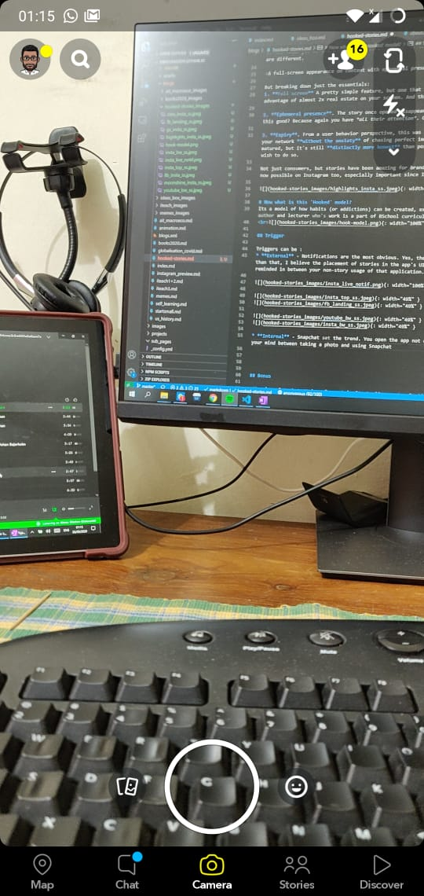{: width="40%" }
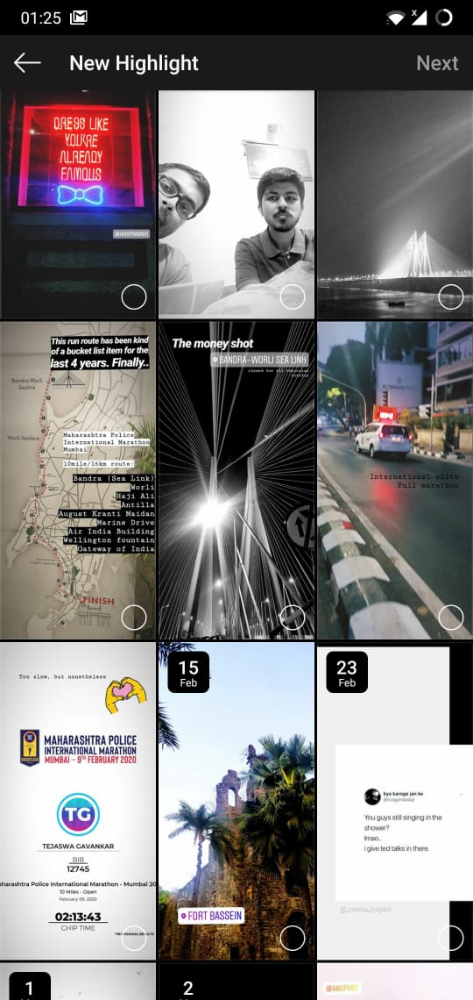{: width="40%" }

## 2. Action
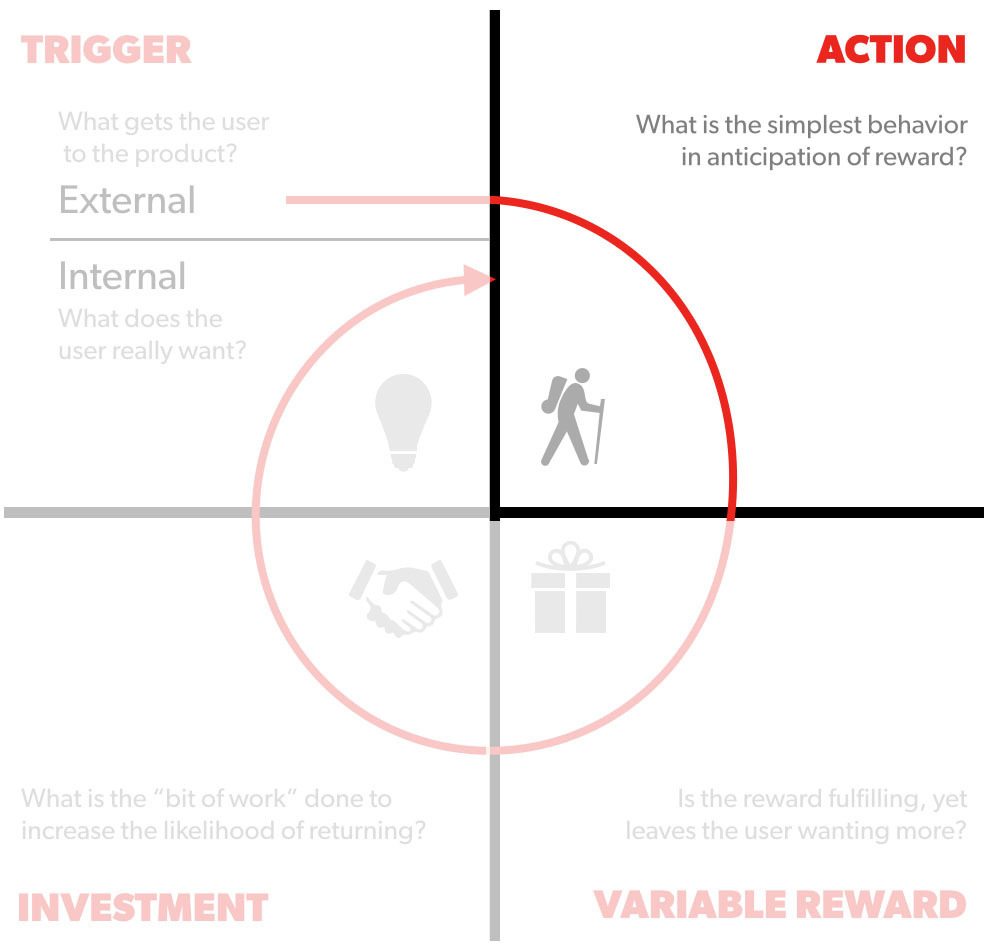{: width="80%" }

Fogg behaviour model: **B=MAT** ➡ Behaviour is a function of **M**otivation, **A**bility, **T**rigger.
The trigger has been talked about above, so lets look at :

### Motivation
Fogg says there are 3 motivators for us as humans:
1. Seek pleasure + avoid pain
2. Seek hope + avoid fear
3. Seek social acceptance and avoid rejection

Social media in general ticks the third box, and even part of the first box. SO yes, the (unhealthy) motivation of social media does exist.

### Ability
Fogg describes 6 things that influence the difficulty of an action:
> Time, Money, Physical effort, Brain cycles, Social deviance, Non-routine. 

Posting a story clicks all those boxes. There is almost no cognitive effort unlike uploading a *post* that would have multiple steps

{: width="40%" }
{: width="40%" }

## 3. Variable Reward
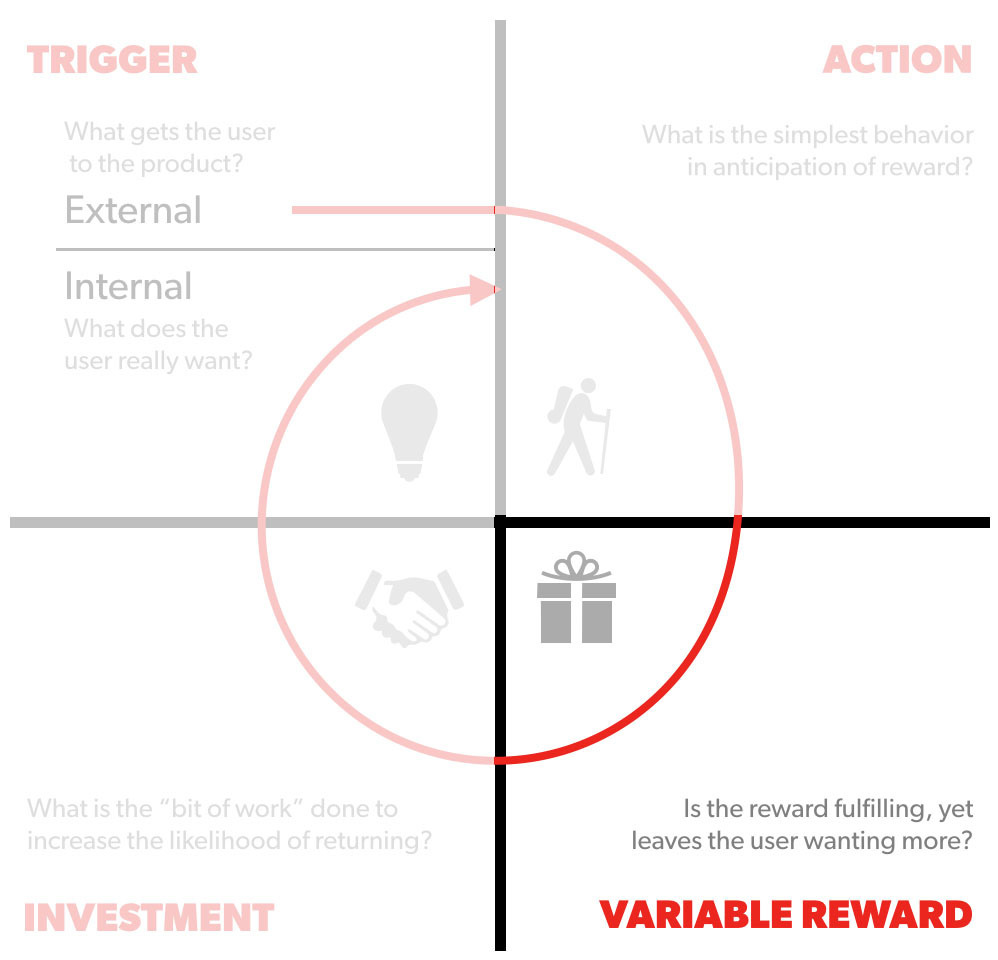{: width="80%" }

Again, just like motivation described above, the **variable reward**  is the same as all other social media platforms - you might get to see something interesting about someone/thing you care about. And this fits into *Reward of the tribe*. 

Click to see a popular experiment related to this by psychologist BF Skinner ➡ [🐦](https://www.youtube.com/watch?v=1u07j0kOyzk){:target="_blank"}.

## 4. Investment
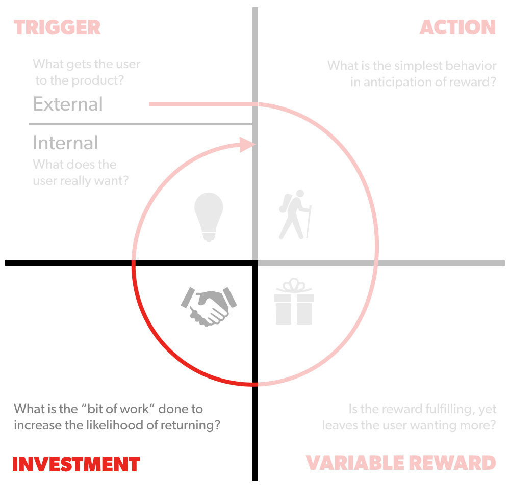{: width="80%" }

What brings the user back to the app?
  The way you can react to a story on Instagram is an obvious way they keep the hooked loop going. The quick reaction options offer a way to react without having to put much thought into 'what to type'.

Likewise Snapchat messages would disappear after being read, so you were incentivised to respond immediately.

{: width="40%" }
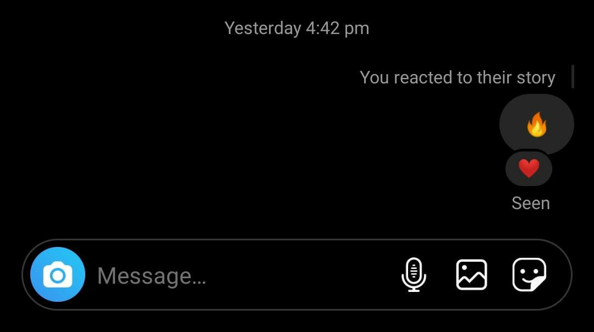{: width="50%" }

## Bonus

<iframe style="border: 1px solid #CCC; border-width: 1px; margin-bottom: 5px; max-width: 100%;" src="//www.slideshare.net/slideshow/embed_code/46975966" width="510" height="420" frameborder="0" marginwidth="0" marginheight="0" scrolling="no" allowfullscreen="allowfullscreen"> </iframe>

This is an amazing PPT about what works for Snapchat. One thing that I don't see anyone mentioning are 'streaks'. 🔥 **Snapstreaks** 🔥 were such an addictive way to keep users coming back every day. I myself would maintain streaks sometimes, and in hindsight, its such a value-less feature who's purpose is almost exclusively to build MAUs, a marvel of user behaviour engineering if there ever was one!

References:
* A neat infographic [summary](https://www.dailyinfographic.com/wp-content/uploads/2018/05/Rise-of-the-Social-Story-Format.png){:target="_blank"}

I have derived my observations primarily from Instagram and Snapchat. Do any other popular apps have stories that differ from these principles? I'd love to know and discuss, let me know in the comments below.