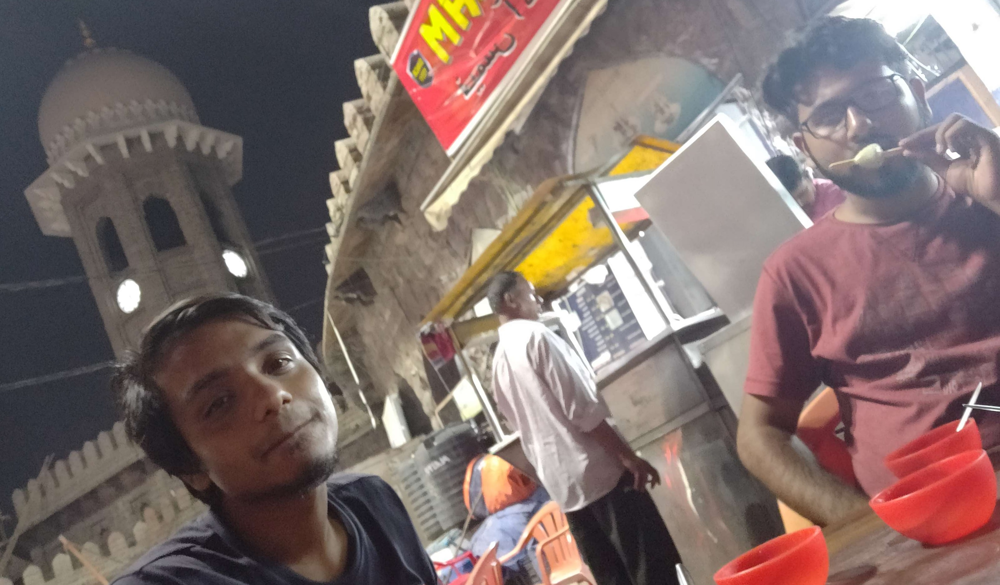

# DAY 1

Shah Ghouse, Toli Chowki
- Maghaz Masala (Bheja)
- Paya
- Khichdi Kheema
- Kaddu ki kheer
- Firni
- Qurbani ka meetha

{: width="80%" }

Hotel Shadab, Charminar
- Mutton Chops
- Changezi Kabab
- Faluda
- Chicken Pakistani, Roomali Roti
- Sp. Chicken Biryani

{: width="60%" }

Nimrah Cafe and Bakery, Charminar
- Fruit Biscuit
- Plum cake
- Osmania Biscuit

Pista House, Saidabad
- Anjeer Kalakand
- Malai Kalakand
- Motichoor Ladoo

{: width="50%" }

Sawera Hotel, Chaderghat
- Luqmi

Karachi Bakery, Mozamzai Market
- Mango Shake
- Assorted biscuits

{: width="80%" }

Famous Ice Cream, Mozamzai Market
- Litchi
- Kharbhooza
- Sitafal
- Jamun
- Pista Kulfi
- Matka Kulfi

{: width="80%" }

Haleem
- Chicken Haleem

Cafe Bahar
- Boti Kabab
- Double Mutton Biryani
- Double ka Meetha
- Irani chai
- Coconut biscuits

# DAY 2

IKEA Food Court
- Swedish meatballs
- Chef's Special Meatballs (Rice)
- Salmon Sandwich
- French Heart
- Apple Tart
- Chocolate Overload
- Cheesecake
- Sultana Roll
- Berry Crumble
- Swedish Tart
- Lingonberry, Peach Chiller
- Danish Spinach Croissant
- Chocolate Croissant
- Yoghurt Softie, Cappuccino

{: width="80%" }

Shah Ghouse, Gachibowli 
- Chicken Mandi
- Special Mutton Biryani
- Kaddu ki Kheer
- Special Falooda

{: width="80%" }

Gokul Chaat
- Cold Dahi Papdi Chaat

Bilal Ice Cream, Mozamzai Market
- Litchi
- Kharbhooza
- Sitafal
- Chickoo
- Mango

Needless to say that I put on quite a lot of weight and was on a diet for the following 2 months to cover for this weekend 😂