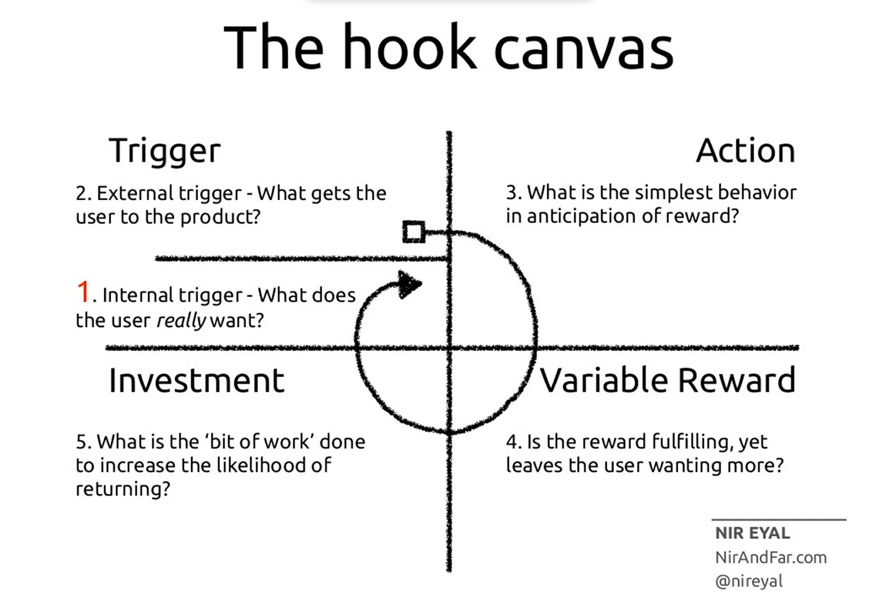

<iframe width="560" height="315" src="https://www.youtube.com/embed/xNjI03CGkb4?si=TjOeuR5MWLVKnnyN&amp;start=17" title="YouTube video player" frameborder="0" allow="accelerometer; autoplay; clipboard-write; encrypted-media; gyroscope; picture-in-picture; web-share" referrerpolicy="strict-origin-when-cross-origin" allowfullscreen></iframe>
_Note: Whales are people who spend a disproportionately larger amount of money on paid features in the game. They are vulnerable to addictions like these._

This video is from 2016, but I think the content is about psychology rather than gaming and will be evergreen. The speaker, Torulf Jernström, founded and ran a game design company for a decade which he sold. Post that, he moved away from games to more innocuous roles. Most recently, he moved to Capgemini to work with banking and insurance clients. In this blog, I am listing techniques that Torulf referred to.

> "Some of you will likely be shocked by the tricks we will discuss here, but I'll leave the morality of it out of the talk, we can discuss it if we have time later"

## In-Game Economy
Have a large in-game economy. Your ARPU cannot be high if there isn't enough to do in your game. So build sufficient scale or scope for a lot of spending opportunities

## Bartle Types
4 quadrant categorization of players based on axes of (1) Preference of interacting with World vs Players and (2) Unilateral action vs Interacting.

| Archetype    | What to sell          | Notes                                                        |
|--------------|-----------------------|--------------------------------------------------------------|
| Killer       | Competitive Advantage | Careful not to upset the game. Needs to at least appear fair |
| Socializers  | Customization         | Will not be sufficient share of revenue                      |
| **Achiever** | Convenience           | Most share of revenue                                        |
| Explorer     | Content               | Too expensive                                                |

## HHH
This is a user lifecycle-based model. Based on the user's maturity in your game, there are different monetization strategies to take. 
1. **Hook** - Provide a no-brainer deal (ice breaker) early in the game so that users get past the barrier of paying for in-game content.
2. **Habit** - For the regular user, provide opportunities for progressing throughout the game.
3. **Hobby** - For the users who've progressed all they could, give them features like faster build times, faster healing times etc. This is where whales can be hunted.

## Gachas
Named after a Japanese vending machine, but the same concept as collectible baseball/pokemon cards i.e. create an illusion of randomness but scarcity for select items. These are great for retention, because users who are close to perfection come back in the hope that the next play/purchase will help them close their goals. [Read more about the Japanese game](https://www.wikiwand.com/en/Gacha_game)

## Operant Conditioning
This is not a technique detailed in the video, but Torulf makes a passing reference to it. Operant conditioning is increasing the cost-to-reward ratio as the user progresses. Eventually the ratio gets so high that the user gets frustrated and has to pay to unlock features to bring the ratio down.

[Operant conditioning - Medium Blog](https://anthonydennis-24878.medium.com/operant-conditioning-how-games-condition-players-44df899c920c)
<iframe width="560" height="315" src="https://www.youtube.com/embed/SWWOzY_tnpA?si=9idNCkCUhX8L44kE" title="YouTube video - player" frameborder="0" allow="accelerometer; autoplay; clipboard-write; encrypted-media; gyroscope; picture-in-picture; web-share" referrerpolicy="strict-origin-when-cross-origin" allowfullscreen></iframe>

## Thinking Fast
From Daniel Kahneman's behavioral psychology - Provide opportunities for immediate gratification in a time crunch. Eg - A 10 second opportunity to respawn from where you just failed. This proves more succesful than providing users with a variety of options before beginning because then they can analyze their options and decide against it.

## Loss Aversion
Taking away something hurts far more than giving something of the same value. Give users possessions while they play and threaten to take it away at the end if they don't pay to retain it.

## IKEA Effect
You value something more when you invested time/effort in putting it together. Torulf did a good job of tying it to the 'Hooked Model', a concept I've written about [before](/blogs/hooked-stories).
The IKEA effect ties to the investment phase of the loop. Give features that return something over time which leads to users returning to appreciate those returns.

{: width="100%"}

## Anchoring
What's the fair value of a special hat on your avatar or a double coins booster for 10 minutes? It's hard to value virtual assets. Developers have the power to set value by assigning prices to items. Initially assign much higher prices, even though you know users won't buy the item. But later when you knock it down with a massive discount, they'll be tempted to purchase it since they were anchored much higher. 

## Social Proof
People do what everyone else does. Make paying for assets the socially acceptable way of playing your game. Show everyone when other users make purchases. Never show the reality that most people are free users.

## Availability

| User Type | Time to Convert |
|-----------|-----------------|
| Minnow    | 8 days          |
| Dolphin   | 12 days         |
| Whale     | 18 days         |

Ensure the game has enough gameplay so that you can keep the big-ticket spenders interested long enough to get them to open their wallets. 

## Loop through Store
Channel the core user flow through the store where purchase options are available. This make it seem like using the store is part of the usual workflow, and not a separate app destination which the user can avoid. 

## Labeling Technique
People are influenced to behave in the way they have been labeled as. I see this in online news all the time - The website talks about the value of independent journalism and how readers like you can support this important mission. Thus, label users are generous individuals and ask them to use in-app purchases to support developers who bring them great games. Additionally, giving reasoning makes people more likely to believe in the request. 

## Four Ways to Progress
1. Skill
2. Luck
3. Grind
4. Pay

Make sure your game is not too skill-based, because then people have no reason to pay. Make grinding and payment obvious as progression options.

## Reciprocity
People feel obliged to return a favor. This needs the gift to be:
1. Unexpected
2. Personal
3. Significant

Incentivize reciprocity among players. This will increase transactions. I believe Reddit could be a good example of this where users can purchase coins/gold to reward other contributors they appreciate. I imagine a lot of the ones who receive such appreciation pass on some love too.

# Conclusion

I found it alarming that at the end of the speech, no one had any questions for him. The video has half a million views and thousands of comments, especially around the ethics of deploying such techniques. But in that room at the Monetize Retain Acquire conference, no one worried about this. I believe they are good people, but it is so easy to change your perspective based on your environment. As Torulf says, replying on sheeple and anchoring expectations are proven techniques of manipulation!

PS: I did not understand the Subscription technique with the Clash of Clans Builder example. If you did, let me know and I'll add it to this list.