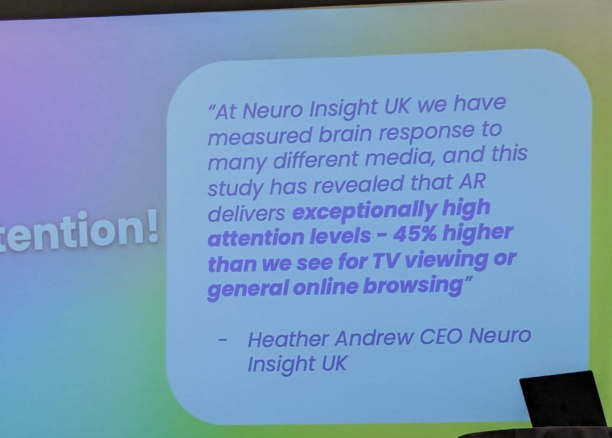
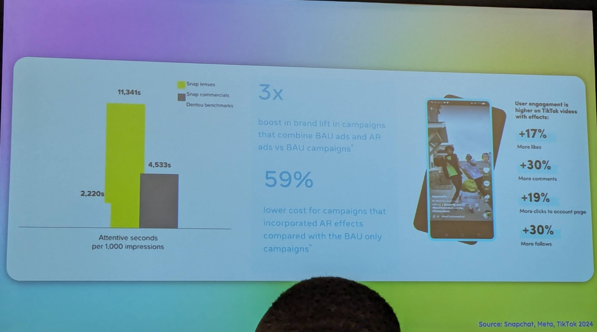
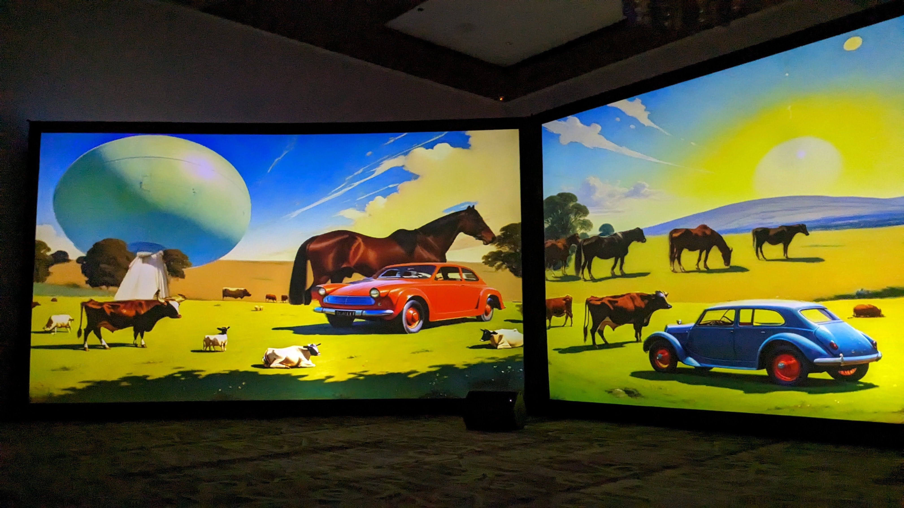
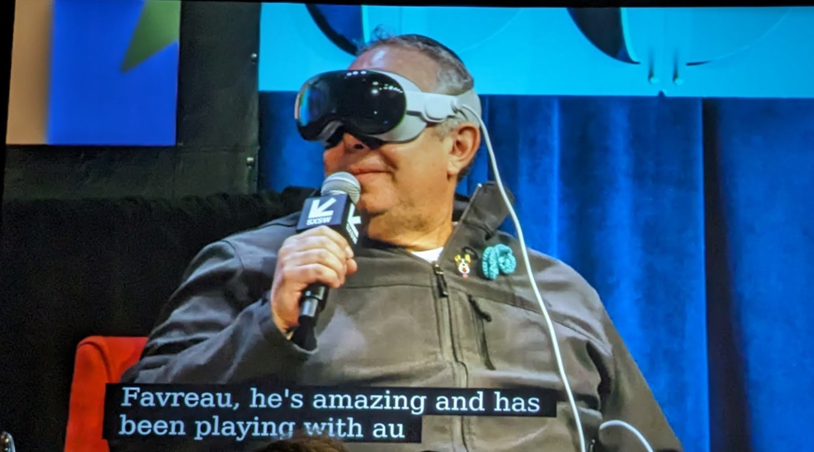
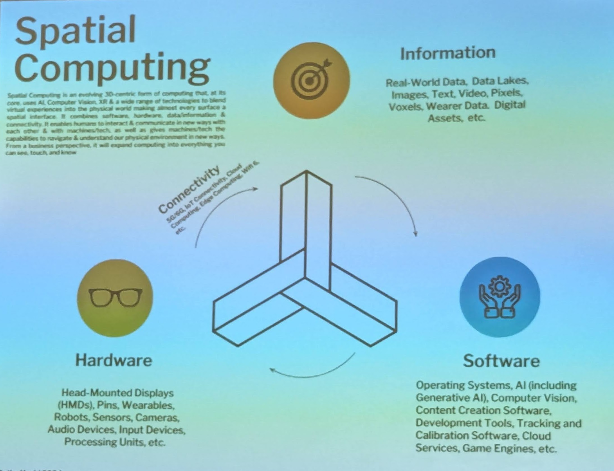
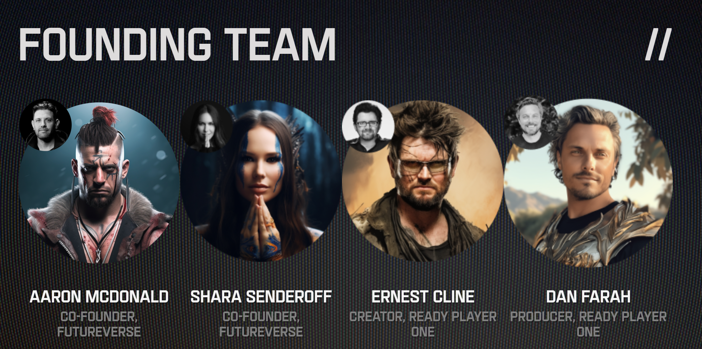

## Table of Contents

- [Spatial Computing and the Web: Bridging Mobile to Headset](#spatial-computing-and-the-web-bridging-mobile-to-headset)
- [Augmented Audiences](#augmented-audiences)
- [XR in the age of Apple Vision Pro](#xr-in-the-age-of-apple-vision-pro)
- [Age of Spatial Computing & AI Wearables](#age-of-spatial-computing-ai-wearables)
- [ReadyVerse Studios](#readyverse-studios)

## Spatial Computing and the Web: Bridging Mobile to Headset

> As the next era of hardware emerges, leaders in spatial computing are creating content that will inspire people to experience it on a headset. This workshop brings together experts who are pioneering the experiences that will be designed for headsets tomorrow and accessible to the masses on mobile devices today. Discussing best practices for creating repeatable immersive experiences and what it takes to build once and deploy everywhere, leveraging the web. This workshop aims to inspire the possibilities of immersive experiences in the browser across headsets, mobile devices, and desktops.
>
>Sean O'Brien, Niantic 
>Nilesh Patel, Meta
>[Event Link](https://schedule.sxsw.com/2024/events/PP145075)
 
- We are probably past peak smartphone sales
- But the premium category is till growing strong.
    - Phones >$600
    - Professional cameras
    - LIDAR sensors
    - Apple ceding market share (dropped 4% from 2022 tot 2023)
- Biggest changes in mobile appstore download categories:
    - Gaming dropped
    - Entertainment rose
- Ownership of AR assets in a Web 3.0 world
- Spatial web can be defined as the an interaction of `people, spaces, and assets`
- Irony of brick and mortar giving way to ecommerce websites and now brands creating AR experiences of the brick and mortars again
- Discussion on Walmart AR:
    - Most of the audience thoughts its inefficient but multiple people brought up accessibility needs. Not just accessibility, but there are behavioral needs too. For instance older people are not enthused by new workflows and services, but are willing to try an AR simulation of the world they are familiar with.
- Native vs Agnostic development
    - Mobile world has only 2 platforms - iOs and Android. So developers can build natively too if they have specialized needs.
    - But if the metaverse is fragmented (like 5 players), products will need to be on a cross-platform layer like WebXR.
    - Niantic’s solution to this is “metaversal” deployment (MR).

## Augmented Audiences

> Augmented Reality has moved from an initial early adopter audience in the tens of millions to approaching 2B monthly active users in 2024 across the web and major social platforms. In order to realise this massive consumer shift in attention, marketers need to start approaching AR with a similar strategy and asset kit they would a channel and move away from AR as purely a format for innovation.
>
>Will Scougal, Make My Day 
>Resh Sidhu, Arcadia AR Creative Studio. Snap Inc.

| Platform | Users |
| --- | --- |
| Instagram | 800M |
| Snap | 300M |
| TikTok | 1 in 4 people |
| WebAR | Unsure |

- Changing a consumer’s perception is the core of every marketing brief. Change = Attention + Relevance + Scale

> The incremental layer of attention that AR brings is like no other touchpoint that marketers have today.
 
- If we had to achieve the same impact with video as we got with AR we would need to run the videos 14x
- KPIs = Playtime + Content + Advocacy
    - This was spoken in the context of interactive AR like social media lenses
    - Playtime - Amount of time spent interacting with the AR experience
    - Content - Amount of time the lens has been used and shared. Each of these instances is a new piece of content
    - Advocacy - People sharing their space with a brand’s messaging. Each time someone shared the lens/filter they are giving their stamp of approval on the experience, and thus to their followers too.
- By 2025, 75% of global population will be frequent AR users ~ Deloitte report  
[Snap Consumer AR_Global Report_2021.key (deloitte.com)](https://www2.deloitte.com/content/dam/Deloitte/xe/Documents/About-Deloitte/Snap%20Consumer%20AR_Global%20Report_2021.pdf)
- Highlighted projects from Arcadia (Snap’s AR studio):
    - Live Nation - Wayfinding app for finding events and friends in a concert
    - Coca Cola - Interactive vending machines
    - Nyx Makeup - Allowing people of all skin tones to try makeup before buying
    - US Women’s Soccer - Fan interactive app that syncs with live score
- Shopping in AR
    - 94% of people who try AR clothes end up purchasing the product —> need to fact check
    - There is still substantial friction in the customer journey
- It takes 2 hours to make a Snapchat lens.
- Arcadia is able to go from idea to experience in 8 weeks

{: width="60%" }
{: width="100%" }

## XR in the age of Apple Vision Pro

> With the launch of the Meta Quest 3 in November, and the Apple Vision Pro in early February, we now have two competing approaches on spatial computing. The comparison to the iOS - Android mobile duopoly should be lost on no one. Many questions about the future of spatial computing are now up for discussion. What are the killer apps? What will storytellers do with the spatial medium? How quickly can Apple get to an accessible price? What wildcards are out there and, perhaps most importantly, what impact AI will have on spatial computing?
>
> Rony Abovitz, Sun and Thunder 
> Charlie Fink, Forbes/Chapman University 
> Joanna Popper, Laurel Beach, Previous CAA, HP, NBCUniversal 
> Ted Schilowitz, Paramount Global

- The [Niederhauser exhibit](https://www2.deloitte.com/us/en/pages/about-deloitte/articles/press-releases/artists-marc-da-costa-and-matthew-niederhauser-present-expansive-generative-machine-learning-works-at-sxsw-presented-by-deloitte.html) demonstrates how the gap between creation and consumption is drastically reducing.

{: width="60%" }
- Apple has almost never done something first. What they are best at is identifying future trends and *designing the best consumer experience* for it.
- VisionPro is like a Mac on your face. It has all the controls you are familiar with.
- Hardware criticism:
    - Why couldn’t the battery be at the back of the head? It’d have helped counter the front-heavy design.
    - Possibly a safety risk (heating, exploding) of having a battery so close to the face. In that case why not decrease the headset’s weight by offloading some of the hardware to the tether.
    - The light seal is great, but it is a magnetic clip on and makes it likely to be held from there and dropped.
- Biggest companies have spent $40-80B each. But there is diminishing quality increments after every dollar.
- The weight issue is an opportunity for ergonomic peripherals.
- Meta has been working on VR for a decade. They are now in their 10th device. They did not want to miss the opportunity to own the OS layer for Metaverse as they missed out in iOS/Android.
- Spatial Imagery can lead to a lot of supportive word of mouth. 1st time the kid walks, elders’ birthdays etc. This can also have ecosystem benefits like Apple photos, iPhone15 Pro (that has spatial cameras)

{: width="60%" }

## Age of Spatial Computing & AI Wearables

> Apple's Vision Pro launch signals the dawn of spatial computing, marking a pivotal shift in how we interact with each other & with technology: How spatial computing extends data and experiences beyond screens and its impact on gaming, entertainment, fashion, retail, healthcare, education, & more. This new paradigm enhances human-to-human and human-computer interactions, merging AI, computer vision, and extended reality to forge deeper connections & redefine our experiences.
>
> Cathy Hackl, Spatial Dynamics

- Advanced interpretation of visuals around us is the next breakthrough. Technology like Humane‘s AI pin is the gap between clunky AR like the VisionPro and the perfect form factor like smart spectacles.
- Described the extension of LLMs as LVMs (vision models like Sora, MidJourney) and LAMs (action models like RabbitR1) which can all give way to Large World Models that extends beyond text, audio, and images to include our physical realities by processing sensor data in real-time.
- A metaverse experience needs:
    - Hardware
    - Software
    - **Information** (Content, digital assets, data)
    - Connectivity (there will be a need for 6G, 7G..)
    {: width="80%" }
- Expressed virtual air rights as a concern. One that might need government oversight.
> This is the coming together of the evolutionary (XR) and the revolutionary (AI).

## ReadyVerse Studios

> Visionary futurist and creator of the groundbreaking franchise Ready Player One Ernest Cline envisioned a future forever changed by technology in his best-selling novel and the Academy Award nominated blockbuster film adaptation that followed, amassing a global fan base and inspiring the transition from science fiction to reality. Readyverse Studios is building a definitive destination for fans to explore their favorite IP in the metaverse, leveraging web3, metaverse games and experiences, augmented reality, and VR technologies that will shift the course of entertainment and technology.
> 
> This panel features Readyverse Studios Co-Founders in their first public appearance to discuss the importance of interoperability in the metaverse, the technology required, and their insights on the significance of IP and brands to the open metaverse, which they view as the next phase in the exciting evolution of the internet.
> 
> {: width="70%   " }

- ['Ready Player One' is coming to the metaverse - Los Angeles Times (latimes.com)](https://www.latimes.com/entertainment-arts/business/story/2024-01-04/ready-player-one-metaverse-readyverse)
- For us, the data layer is the most important. Our mission is to make it interoperable. The tradeoff with interoperability is that end user apps need to build a lot of compatibility if they want independent ownership. Our platform has a metadata layer with the player’s specific information that all developers can use, but is owned by the user.
- Intellectual Property
    - Studios want to put their IP in our metaverse
- Surreal estate - Self-designed or branded (paid options available) estates you can make for yourself. We imagine this is a home location and you hop into portals from it.
- Open Gaming Verse -
    - Unity Unreal 5,
    - AAA
        - First AAA metaverse platform - informal classification used to classify video games produced and distributed by a major publisher which typically have higher development and marketing budgets than other tiers of games
        - Branded with IP of leading studios
    - MMO (massively multiplayer online) experience, branded
- HUNTS:
    - Similar to the quest in the Ready Player One movie
    - You won’t know you are in a hunt until you already are in it.
    - Piloting with Reebok
- What will (the really serious RPO) fans think about this (seemingly) overly commercialized platform