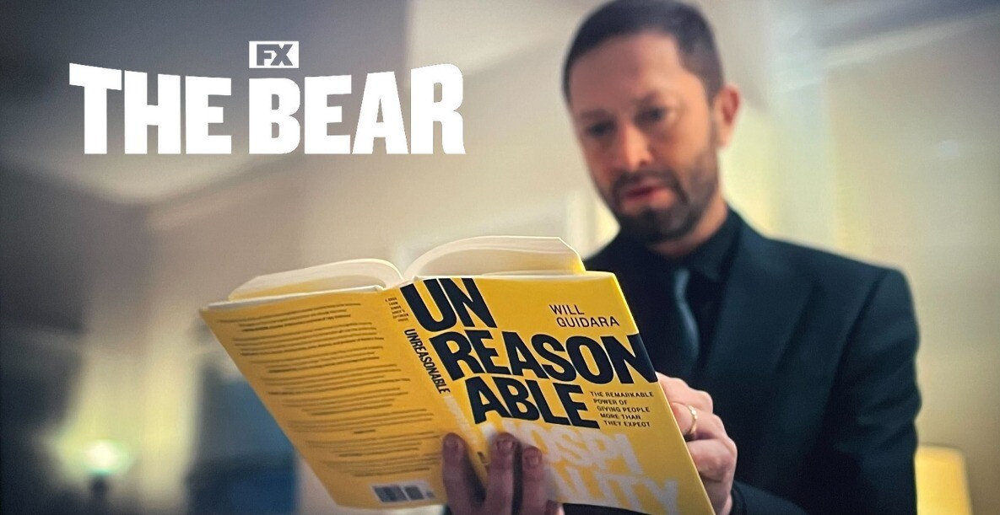

I purchased this book last year when I saw "The Bear", a high strung loud show about the journey of a restaurant climbing in reputation from a hole in the wall to a Michelin Star. Much of the high-quality service that defined the customer's experience is inspired by Will Guidara, who co-produced the show and wrote this book. Also, Eleven Madison Park, Will's claim to fame, was in the building of Credit Suisse New York, and I used to often hear about it from my colleagues before I knew the restaurant’s legendary reputation.

I'm not an aficionado of fine-dine, but what I took away from the book is:
# 1.	Story of perseverance, that's inspiring in any role,
> “Nothing in this world can take the place of persistence.  
Talent will not; nothing is more common than unsuccessful men with talent.  
Genius will not; unrewarded genius is almost a proverb.  
Education will not; the world is full of educated derelicts. ~ Calvin Coolidge

# 2.	Customer Centricity in the service industry.

Delivering a memorable experience does not always need a lot of time or money. For instance:
- When a group of diners from LA jokingly mentioned that while they were loving the fancy food, they really just wanted a New York street hot dog. Will took the request seriously and ran out, bought a classic NYC hot dog from a food truck, and had it plated elegantly. The diners were blown away and this turned dinner into a memorable, personal moment—one they would talk about for years.
- In a workshop with realtors, they brainstormed how the realtor could leave a yoga mat stretched out before the buyer’s move-in for someone who mentioned that they could imagine themeselves working out in the light of a room.
- Memorable experiences can also be planned through patterns. For instance, for diners who are flying out soon, Will had great in-flight snack packs pre-prepared.

# 3.	The way you do one thing is the way you do everything
This reminded me of another viral lesson from [Make Your Bed by Admiral McRaven](https://youtu.be/yaQZFhrW0fU). He talks about how Navy SEALs would make their bed perfectly every morning. A task of no apparent value, but one that reinforced that what they can control can be done perfectly, and reinforcing the mindset to tasks on the battlefield too. Will shares how servers would plate symmetric plates such that the logo on the back is always aligned the same, even though diners rarely flip their plates. 

I recently had a conversation with a fellow consultant where we wondered why we need show and pomp for the slides and communication of internal meetings, at the same quality level as when we serve clients? Barely a year into this role, I can spot discrepancies in fonts, alignments, and all the other annoying things. Consultants often work on these internal initiatives in between client projects, and this rigor and muscle memory better prepares us for when perfection matters to the business.

This begets the question - Does it matter to the business? Do clients even care? Surely, they aren’t paying these exorbitant sums for consistent HEX color codes and slide footers? Will brings up an example from the enchanted Tiki room at Dinsey Parks. Dinesy's Imagineers had built one of a kind lifelike robotic birds, to which Walt Disney responded- “But they don’t breathe.”. These birds that could move, sing, and blink were a marvel of engineernig and a part of a much larger experience. Did their breathing matter?

Walt replied that while guests might not notice this itself, “Perfection can be felt” Perhaps this is why consultants obsess over the mundane? While the exact strategy recommended on those slides can be debated, the **perfection in the delivery of the message inspires confidence in the message itself**.

# Memorable Quotes
> "Sometimes, magic is just about spending more time on something than anyone else might reasonably expect."

> "All it takes for something extraordinary to happen is one person with enthusiasm."

> "You need to be unreasonable to see a world that does not exist yet."

> "Be the swan."  People see your graceful neck gliding over water while you webbed feet paddle chaotically under the surface

> "The secret to happiness is always having something to look forward to."

> "The way you do one thing is the way you do everything."

> "Do less, but do it well."

> "When you hire, ask yourself if this person could be in the top 3 people in your team someday."

> "Aggregation of marginal gains."

> "Nothing in the world can take the place of persistence."

> "The secret to happiness is always having something to look forward to"

> "The way you do one thing is the way you do everything"

> "Every night that Bruni (NYT food critic) was not at the restaurant, we designated a table as the critic's table to simulate perfection."

> "You can’t use up creativity. The more you use, the more you have."

> "Chose conflicting goals", in pursuit of it you might build something truly diffrentiated.  
For example, fine dine (excellence) and hospitality (situational felxibility) at Eleven Madison Park, or SouthWest Airlines' that aims to be the best in cusotmer and employee experience while also being a low-cost airline. 

