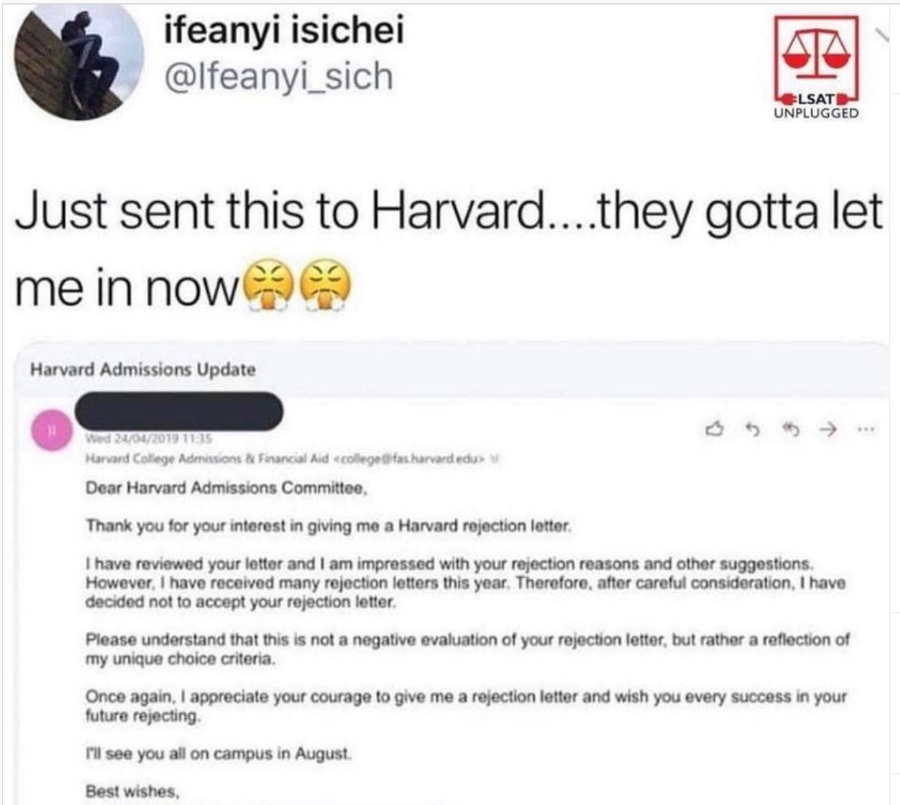

My stats in what I believe is the order of relevance:

| Nationality         | Indian                                         |
|---------------------|------------------------------------------------|
| Work Ex             | SDE at a major MNC                             |
| GMAT                | 740 (same year)                                |
| Years of Experience | 4 (@matriculation, i.e. when starting the MBA) |
| Education           | Engineering (Computer Science)                 |
| GRE                 | 325 (4 years old)                              |
| TOEFL               | 119 (same year)                                |

Since there is no formula to knowing which school you can end up in, the only way to know is from others' experiences. Unfortunately, you can only find the one school where the person got in and not the other schools they got/didn't get in. Hopefully transparency in my success/failure can be one more datapoint in your decision.

{: width="60%" }

| Status                | School                                                                                          |
|-----------------------|-------------------------------------------------------------------------------------------------|
| Admitted              | Marshall, Tepper                                                                                        |
| Rejected w/ interview | Fuqua, Booth                                                                                    |
| WL w/ interview       | Haas, Fuqua                                                                                     |
| Interviewed           | Fuqua, Booth, Gouizueta                                                                         |
| WL w/o interview      | Stern, Tepper                                                                                   |
| Directly rejected     | Columbia, Wharton, Anderson, LBS                                                                |
| Applied               | Marshall, Haas, Fuqua, Booth, Gouizueta, Stern, Tepper, Columbia, Wharton, Anderson, LBS, Sloan |

{: width="60%" }