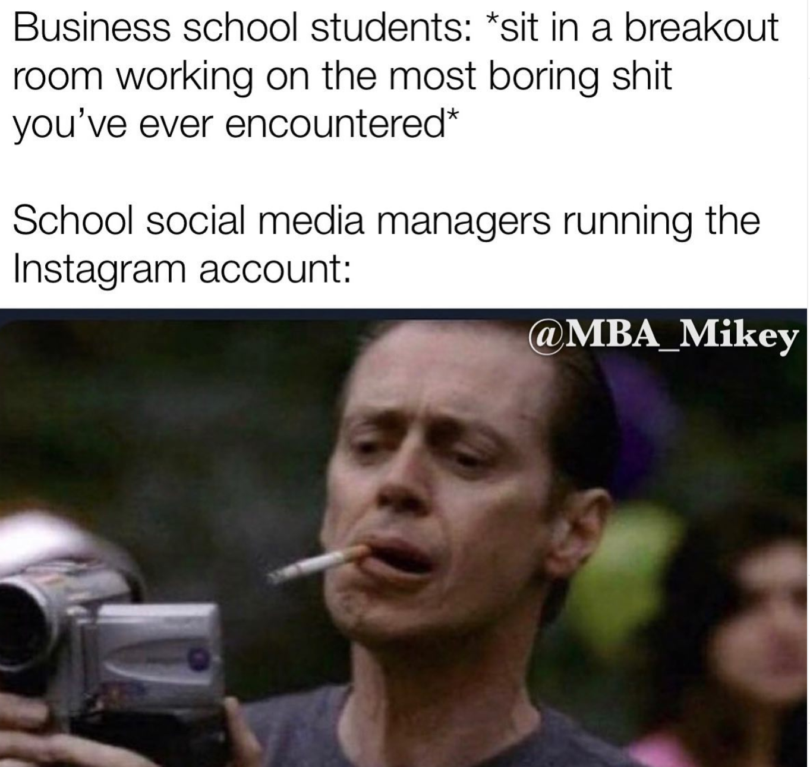
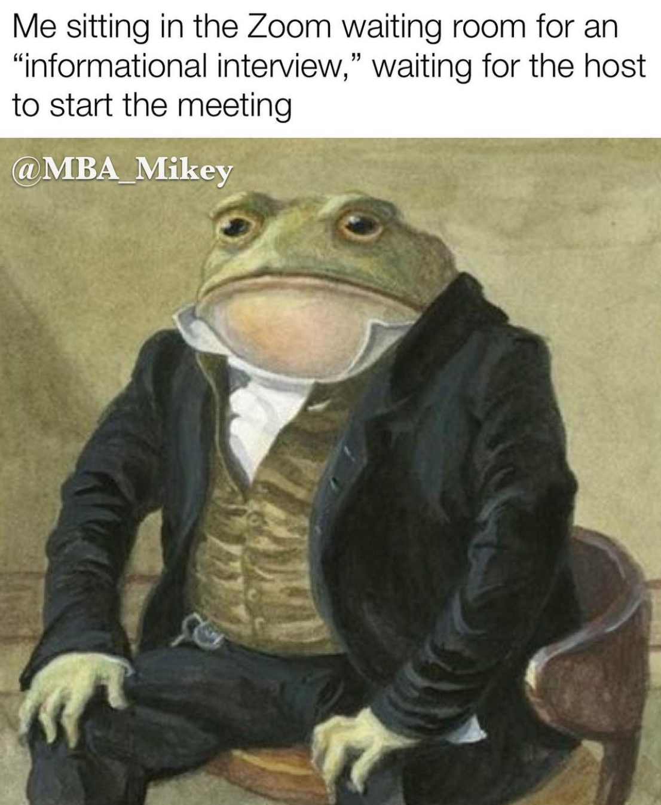

## Step 0: Email ID
Secure a professional email ID if you don't already have one. name@gmail.com and its variants are fine. cool_name_rockstar@gmail.com is not. Use one email ID across the whole admissions process. It is the primary key with which your application form, presence in events, follow up email Qs, etc are all monitored.

## Step 1: Subscribe 
Follow all the social media pages. Not just the school's primary page, but look for an admissions page, a south Asian club page, professional pages like the tech/consulting/finance page, any other interest-related clubs like the Outdoors page. While you're at it, follow the meme page too ([@sternmbamemes](instagram.com/sternmbamemes), [@fy_andermemes](instagram.com/fy_andermemes), [@andermemess](instagram.com/andermemess) not to be confused with [@uclacenterformemes](instagram.com/uclacenterformemes)!).

{: width="60%" }

Also look for podcasts. Most schools now have official podcasts. There are standard admission ones (Ross, Darden), but also genuinely interesting business-related ones ([LBS](https://open.spotify.com/show/6JKysHC1QneF8dQgEazK5w?si=4c99535c8fe44127), [Haas](https://open.spotify.com/show/7GgdsWkc2loW9FShudOHVu?si=69f4d3a324894f88), [Haas FinTech](https://open.spotify.com/show/00VtCLinxTk1O5J1iJGZ4l?si=54d6bccb91a94e90), [Kellogg FinTech](https://open.spotify.com/show/1jPg4qsoXLrujdD2VtgacW?si=93abbc52d48c466a), [INSEAD](https://open.spotify.com/show/7uaaPtjcSm0KAWOjLxITX5?si=698f0aded511418d)). 

There are YouTube channels too. I did not check them for all schools, but for the few that I did, they covered a lot of information too.

## Step 2: School websites: Part A
Visit these sections of the schools you're interested in:
- [Class profile](https://www.fuqua.duke.edu/programs/daytime-mba/class-profile)   
- [Career report](https://www.fuqua.duke.edu/sites/www1.fuqua.duke.edu/files/media/programs/daytime/revised_employment_report_2020_4_9_21.pdf) 
- [Deadlines](https://www.fuqua.duke.edu/programs/daytime-mba/admissions-facts-dates)
- [Costs](https://www.fuqua.duke.edu/programs/daytime-mba/tuition-costs)

Feed this data into a master sheet that you will sue throughout your process when deciding where to apply, when deciding which admit to choose..
[Here is one](https://coepac-my.sharepoint.com/:x:/g/personal/tejaswaljg14_comp_coep_ac_in/EeDMIc9SU2hAqSuZtxr7C5IBV1JXXaigxe5wjGmmGkkvkQ?e=JqFemL) that I painstakingly created, note the number of columns. The data fed was what was available in Dec 2020, so consider refreshing it. But even if you don't its a good place to start.
Sign up for updates / fill form to ask for an e-brochure. One way or the other the school asks your email ID to send promotional emails and events. 
This is enough for now. You'll need to visit the school website 2 more times as I'll elaborate in the next steps. 

## Step 2: Make your own wikis for each school.
I ended up with the following template for each school:

## School Name
### Application form link/username/password
### Stats
Can keep the bare min stats here, since most stats will be available in your comparative sheet <link>.
- Class size
- Location
- GMAT stats
- % placement in my target industry

### Pedagogy
- Any predominant/popular style of teaching (Darden/Harvard's case methods, Ross's action-based learning, Haas' applied innovation)
- Courses and professors you care about. Wherever possible, [link the class](http://registration.darden.virginia.edu/Course/Info/Abstracts_New/8459-1617.htm).. You will need to refer it in the future to recall specifics about it.
- Academic centres (Data Science, Sports Marketing, Healthcare) that you care about.
- Core curriculum duration (Booth's no-core vs Darden's full year core).

### Clubs
Make note of any distinct activities the club does, the conferences/events/workshops they host.
- Professional
	- Consulting club
	- FinTech club
- Affinity
	- South Asian business club
	- LGBTQ club
	- Women in business
- Interests
	- Outdoors club
	- Music club

### Misc
- Reputation as a party school.
- Fridays off, so weekends available for other pursuits.
- Too cold in winters.

### Admissions
- Essay/cover letter/video Q
- 1-2 LoRs. Any difference in LoR format (<see my recommendation tips>)
- Scope of a referral (from alum/current student: Eg: [Fuqua](https://admissions.fuqua.duke.edu/register/?id=2c0d233d-31b3-47cf-bff4-4081d1fd2f41) and [Booth](https://www.chicagobooth.edu/shapetheclass/recommend))
- Any application fee waivers (Eg: Fuqua, [Tepper](https://www.cmu.edu/tepper/programs/mba/admissions/mba-admissions-blog/2020-09-18-chart-your-path.html))
- Tips from the adcom (Eg: Yale explicitly saying don't force 'Why Yale' in our essay, Sloan's grid based shortlisting process)
- Scholarship stats
- TOEFL needed?

### Networking
Most important section. When you attend an event, make note of the event name, all the representatives involved (adcom, students, alumni), and the dates. ([Or maybe send a bot](https://beulr.com/#how-it-works)) Many schools ask (in both application form and interviews) which events did you attend? Whom have you spoken to? All this comes in handy there. Examples:

#### Behavioural Economics Masterclass, 2 August 2021, <ins>[Devin Pope](https://www.chicagobooth.edu/faculty/directory/p/devin-g-pope)</ins>, Kara Northcutt (AdCom)
- One of the founders of this field teaches at UofChicago itself. (nobel)
- Talked about car resale left digit bias, [auction economics](https://www.youtube.com/watch?v=jMOcr5a7-fo)
- He's currently working on a Lyft Pricing project. Will be published soon. He was curious from his Uber ride why Uber was not doing left digit pricing. Very conveniently [John List](https://www.linkedin.com/in/john-list-4727b6a/) , chief economist of Lyft is prof at Univ of Chicago. Now Lyft will be doing left side bias too.
- Red cross gave half people gift card and other half nothing for donating blood. Giving money 2x the participation. He gave this example to show that while behavioural economics shows interesting stuff, but neoclassical/standard economics works most of the time. 
- He is a Part-time amazon scholar
- Consumer behaviour class at Booth is taught by psychologists, not marketing guys
- Behavioural economics is a concentration in MBA along w/ being a core class
- he is currently looking at vaccine incentives 
- What stands out in Boothies? Nerdy. Students take class seriously (Maybe even peer pressure to do so). 

#### 1:1 w/ <ins>[John Doe](https://www.linkedin.com/in/tejaswa/)</ins>, 27 December 2021

- Really nice guy! johndoe@wharton.upenn.edu
- Economic consulting at Brattle (legal lens). Did a geo-data route mapping for national shipping company.
- Tech paths:
	- PM side is easy
	- Tech strategy (M&A, growth, GTM) and ops (integrity of data, supply chain, availability) - Difficult to get in w/o consulting experience. I tried but it didn't work out.
- Analytics here is geared to people w/o background, might not be so relevant for you. Regarding flex core - Academics actually don't matter for recruiting, but clubs do.
- Gaming was a side-tracked thing I pursued for fun. I wanted to do Management Consulting and will be recruiting into it full-time (entrepreneurship in long run. Consulting gives matrix of both industry and function).
- When I asked about my <> passion - The large class size means you always find people interested in something niche.

The stuff so far are facts, but what do they mean to me?  

So, after filling the template, I'd make a brief table (that I now realize is a SWOT analysis) based on the feelz:

| What I don't like | What I like |
| {::nomarkdown}<ul><li>$$</li><li>So much of what they are selling is just their location.</li></ul>{:/} | {::nomarkdown}<ul><li>NYC</li><li>Opportunities to work with companies during terms too</li></ul>{:/} |
| What does not work for me | What works for me |
| {::nomarkdown}<ul><li>1% of class works in FinTech. So I can't use my FinTech career story.</li></ul>{:/} | {::nomarkdown}<ul><li>Median GMAT</li><li>Essay Q resonates with me, should be able to write a good essay</li></ul>{:/} |

## Step 3 : Visit each school website: Part B
If done in detail, this can take hours.

You'll probably be visiting Academics ([Example](https://www.fuqua.duke.edu/programs/daytime-mba/curriculum) and [Example](https://www.fuqua.duke.edu/programs/daytime-mba/concentrations-certificates)), [Career resources](https://www.fuqua.duke.edu/programs/daytime-mba/career-development), [scholarship info](https://www.fuqua.duke.edu/programs/daytime-mba/financing-your-degree) (usually averages are not published), [centers](https://www.fuqua.duke.edu/faculty-research/centers), [clubs](https://www.fuqua.duke.edu/faculty-research/centers)

You need to go beyond the surface level. Everyone will quote Darden's case study method and Booth's flexible curriculum. You need to be able to also talk about [Darden's first coffee](https://www.mbamission.com/blog/2013/01/24/beyond-the-mba-classroom-first-coffee-at-darden-2/) tradition and [Booth's random walks](http://randomwalksbooth.org/).

Some schools also have extensive blogs (Eg: [Stern](http://blogs.stern.nyu.edu/full-time-mba/))

## Step 4: The human connect
Easiest way to do this: Each school has an admission events page. Sign up for the events that interest you. Consider time zones when registering (I loved [this browser extension](https://chrome.google.com/webstore/detail/time-zone-converter-savvy/plhnjpnbkmdmooideifhkonobdkgbbof?hl=en)). Slots are often limited, don't block one that's at 3am IST which you will not attend. Also, schools might be monitoring consistent absences.

{: width="60%" }

Live events are better as you can express your interest and ask Qs. But in case you're not able to attend the event, some schools have pre-recorded ones too (Eg: [Booth's masterclasses](https://www.chicagobooth.edu/events/masterclass), [Wharton's webinars](https://mba.wharton.upenn.edu/view-virtual-events/)).

Events aside, what about humans?
- [EASIEST] Admission ambassadors:
	- Easiest point of contact. Each school has a page where their basic profiles and email/calendar availability is provided. [Example](https://www.fuqua.duke.edu/student-network/daytime-student-ambassadors). It's their job to speak with you, so you're almost always going to get a zoom call with them.
- [BEST] Other students/ alumni:
	- Reach out on LinkedIn/ email panelists after admission events.
	- It has lesser turnover than admission ambassadors, but still not bad. I found 3/5 LinkedIn requests were willing to help. Of course, you have to write a simple but relevant note (in free version of LinkedIn) to go with your connection request.
		- Eg: Hey Parth, I am applying to Darden in a few months. I wanted to know about places where I can contribute at the school, and DSTAB looked interesting. The website does not have much information though. I wanted to hear from a past member like you about what kind of work you did there🙂 Thanks!
		- I did not do so, but I think it's probably worth taking LinkedIn Premium for these few months. At one point LinkedIn even blocked me for searching too much.
		- Start smart. Filter people with same undergrad college, same company, 2nd degree connections..
	- Admission ambassadors might have 2 problems.
		- They are official ambassadors of the school and might not be totally candid.
		- They're great for asking Qs about the course, but if you hint at personal advice, you'll be given diplomatic responses. Eg: The Haas ambassadors said they're not supposed to help prospective students with applications since they want to make the process fair (I don't see how this was unfair..). Meanwhile a LinkedIn connection not only answered all my factual questions, but reviewed both my essays, and took a mock interview for me.
- Admissions Committee (AdCom)
	- Many schools have options to schedule time to talk to members of the adcom ([example](https://apply.darden.virginia.edu/portal/coffeechats)).
	- Stakes are higher when communicating with adcom. If you are not totally sure about what you're going to be talking with them about, I'd recommend avoiding calls and use emails to answer basic Qs.
	- Besides, they do not help you think about what to write in essays. They do not answer questions that are too specific to the program, instead they refer you to their student ambassadors. So really, there usually isn't a need to contact them (unless you come from a non-standard background and have genuine questions)
	- Anyway if you ask too
- Your own network, keep an eye out
	- I randomly met a Darden alum at a bard game cafe.
	- If you work in a reputed company, look around for your manager, manager's manager, clients, earlier clients (or just get on LinkedIn and find colleagues to cold call). They all can provide very relevant info to your profile, maybe act as recommenders, and at the very least they're great to mention in essays/interviews. I found Cornell, Booth, and IE alums.
	- I was surprised to find a family friend at an M7.

Other tips:
- Connect with people with a shared interest/background. Talk about the career choices they evaluated, the courses you noted, the courses they enjoyed, examples of the alumni network they've observed, you can try asking what they spoke about in their essay.
- This is not a very useful thing to advice: Try to be warm and connect. Don't be transactional in your 30min. The depth of few relationships can go much longer (see my Haas example above/ referral if allowed) than many 30min rushed calls.