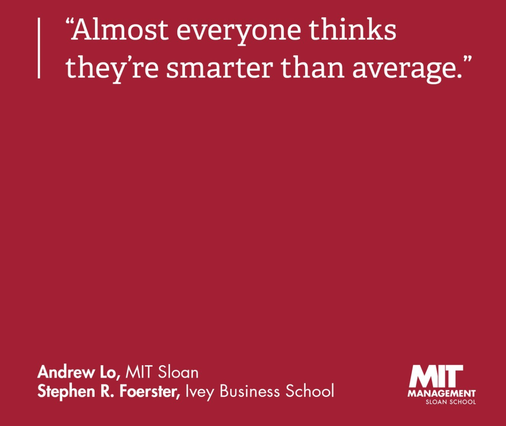

This was the biggest question I had in the entire application process.
TL:DR; There is no answer. It's intuition.

I had all kinds of questions:
Should I apply to Stanford? Admissions say that review is holistic, I can probably get in. Surely my essay will be special.
Should I apply to Marshall? Will I even get in? Is T20 too ambitious? Should I apply to Vanderbilt Owen instead?

{: width="60%" }

I playfully created this comparison of reputation that might have some legitimacy:

| India | US | 
| --- | --- |
| IIM A | Harvard, Stanford, Wharton| 
| IIM B, C| M7/M8 | 
| IIM LKI, ISB | T15 | 

- GMATClub created this tool: [Link](https://gmatclub.com/forum/what-are-my-chances-profile-evaluation-tool-309854.html) (fill advanced parameters too). Can't comment on it's accuracy.
- At the start of my process, I reached out to some big admission consultants ([mba mission](https://www.mbamission.com/consult/mba-admissions/) , [Accepted](accepted.com/mba/free-admissions-consultation, fortunaadmissions.com/free_consult/) ) for their 30min conversations where I got their opinion on the matter. I'd recommend this. They're good and it's free, nothing to lose. In case you choose to work with them (more on that later), you also got a feel of a potential consultant.
- You can ask for a profile eval on [reddit](https://www.reddit.com/r/MBA/?f=flair_name%3A%22Profile%20Review%22) and [clear admit](https://www.clearadmit.com/livewire/) (Wait for official comments, ignore the voting. I got anonymously discussed in one of their podcasts too).

What left me confused for the longest time was people asking me to choose the school where I "fit". 
F I T 
Ross goes so far as to suggest having an excel tracker of how you felt talking to alumni from diff schools to compare their cultures. 
Put a pin in this (and small/big town, warm/cold weather, small/large class size) for when you have multiple admits to choose from. For applications, stick to competitive factors. 
[Team Fuqua](https://blogs.fuqua.duke.edu/duke-mba/2018/04/09/bill-boulding/what-is-team-fuqua), or Marshall's Unwavering Integrity aren't things that should influence most people's choice of schools.

For over represented categories (Indian, Chinese, Bankers, Consultants), GMAT/GPA is far more likely to get you rejected or a pity spot at the end of the waitlist. As an Indian+Engineer+Male I was really hitting the ORM jackpot.
Note: ORM = Over represented majority, URM = under represented minority. Terminology from discussion forums.

There is obviously a lot more that goes into decision making. Happy to chat with you (email me) about your school choices if you think it'll help.

