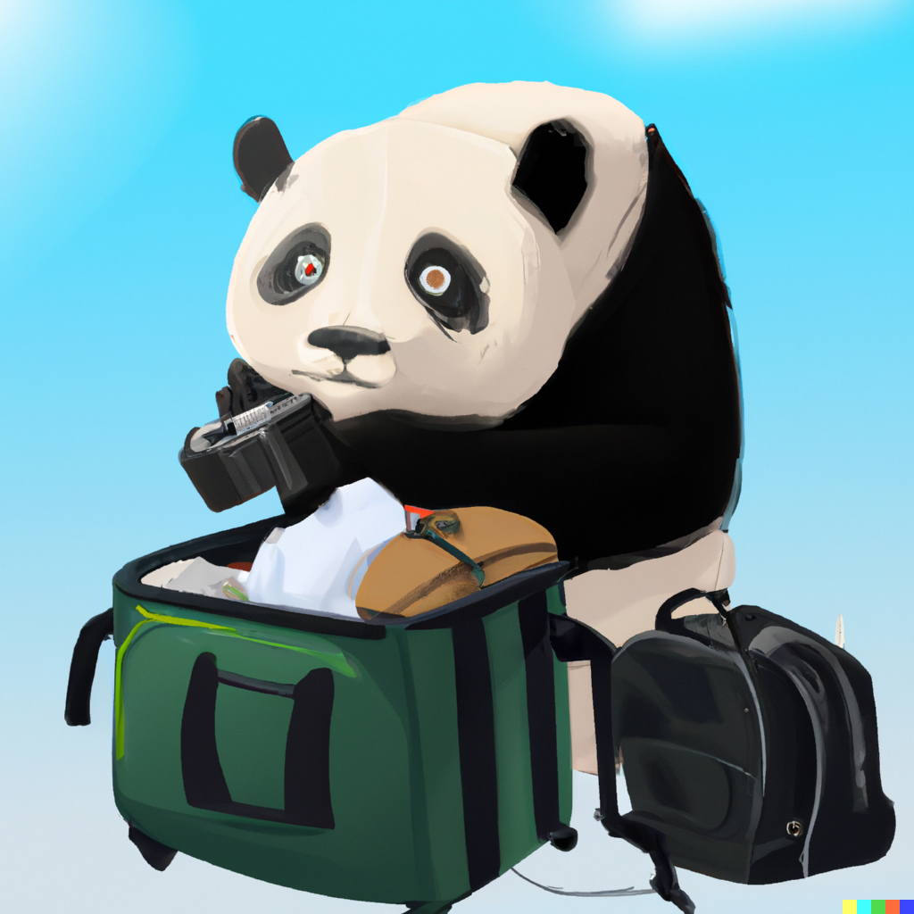
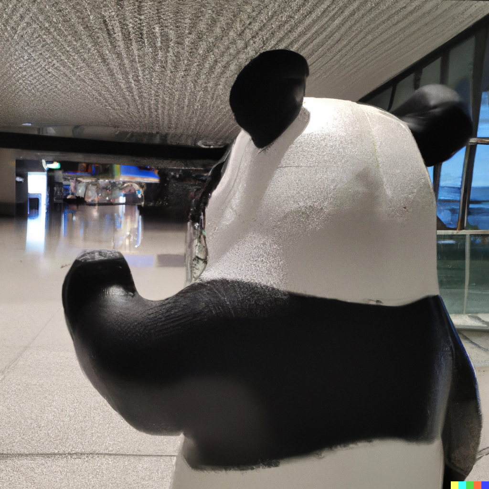
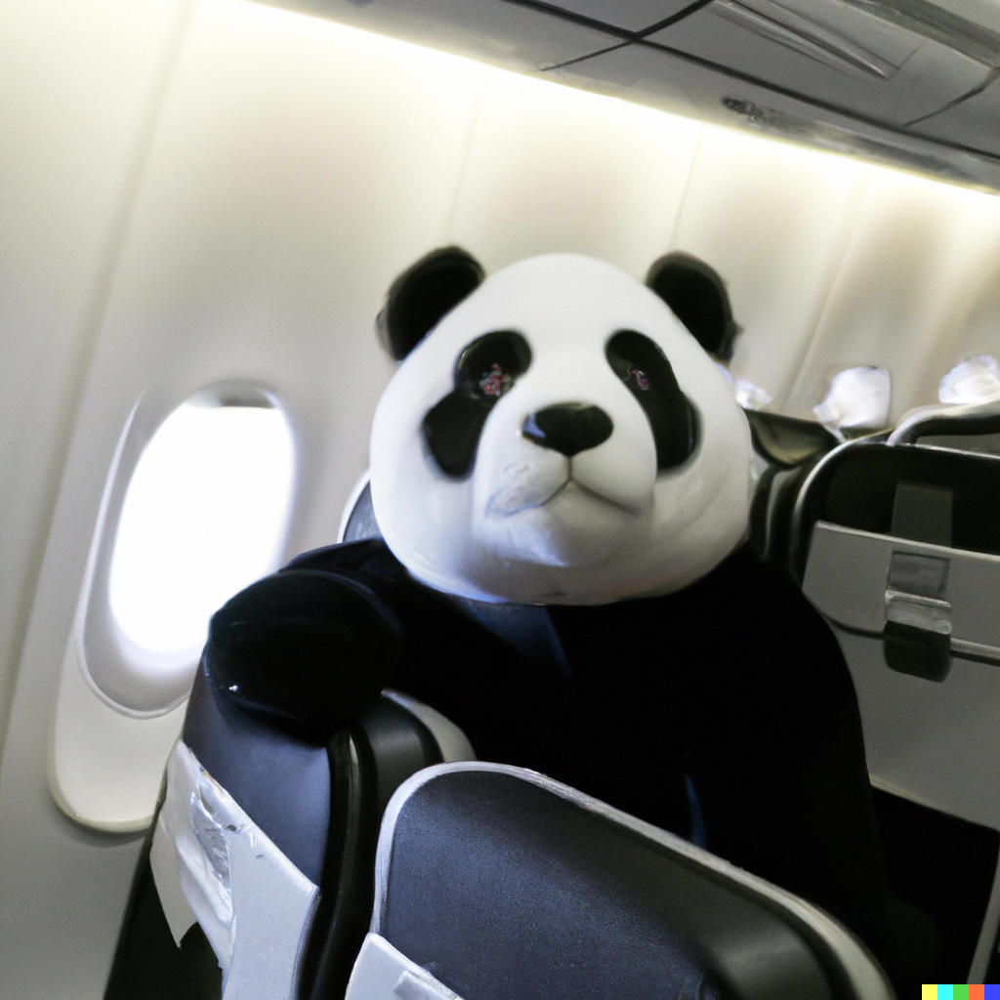
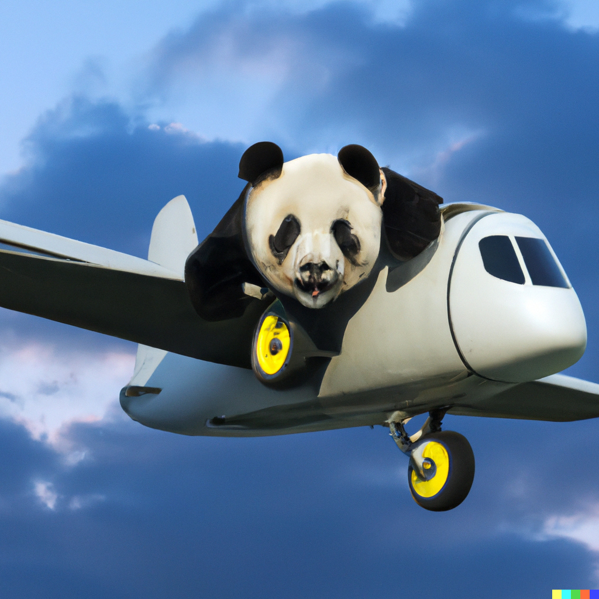
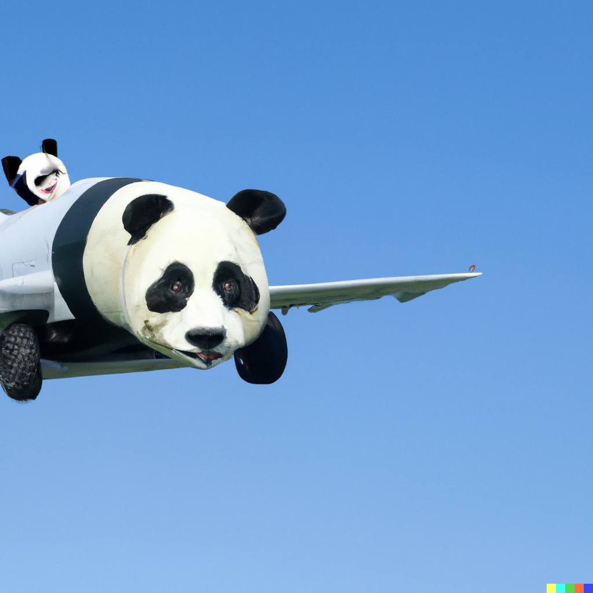
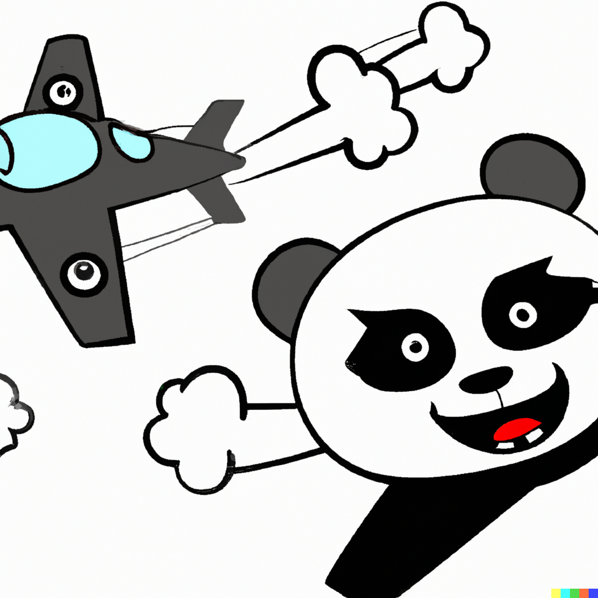
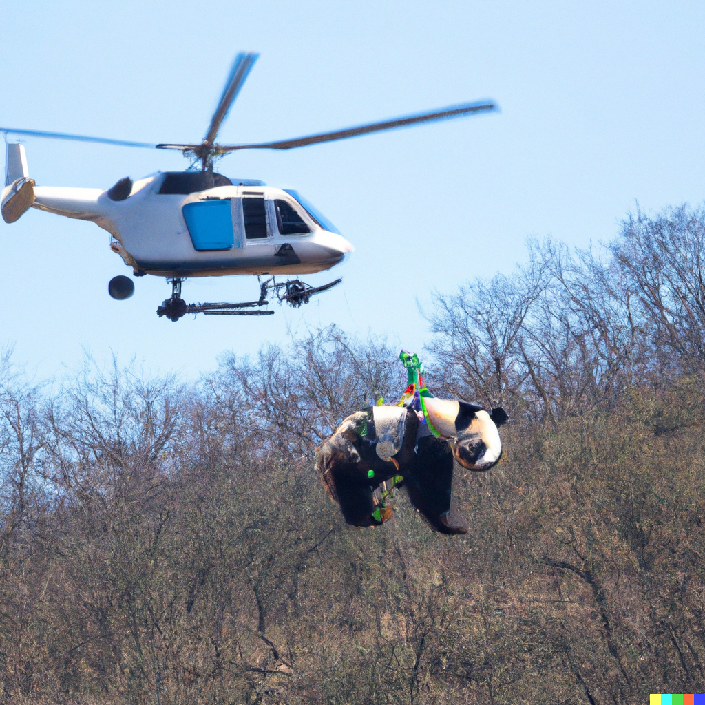

I just got access to OpenAI's Dall·E after being on the waitlist since July!
I've seen examples, I've read about it, but there is nothing like playing with the app yourself!!

Last year I had experimented with their GPT-3, training a bot to imitate a [group chat with my friends](https://tejaswa.me/projects/gpt2Whatsapp.html). GPT3 however was a lot more technical; Dall·E is sooo simple.

What is it? Put simply, it's an AI that makes an image from a prompt. With GPT3 we could create life-like text, essays and stories from AI. Dall·E brings visual CREATION to the world of AI.

## I made a small story of Debu the panda going on vacation.

| Debu packs a travel suitcase

{: width="25%" }

| Debu gets some overpriced coffee at the airport

{: width="25%" }

| Debu got the window seat because he's so cute

{: width="25%" }

| Debu hijacks the plane (what?)

{: width="25%" }
{: width="25%" }
{: width="25%" }

| Debu's jet gets shot by a fighter jet

{: width="25%" }

| Debu escapes with a chute

{: width="25%" }

| However choppers pick him up

{: width="25%" }

That's all folks!  
{: width="40%" }

Well not really.
I asked GPT-3 to extend this story in a dark theme. The text in italics is the generated text:

| Debu packs a travel suitcase. Debu gets some overpriced coffee at the airport. Debu got the window seat because he’s so cute. Debu hijacks the plane. Debu’s jet gets shot by a fighter jet. Debu escapes with a chute. However choppers pick him up. _Debu’s interrogated, and they want to know why he hijacked the plane. Debu snaps at them and is taken away._
| _Debu is placed in a room with a window. Debu contemplates jumping out of said window, but instead he takes off his shirt and cries. Debu’s interrogated again. Debu tells them that he’s a man that loves his wife, but she no longer loves him. Debu wants to die because he doesn’t want to continue living with this shame and pain._
| _The officer in charge of the operation, Captain Tetsuya Ogawa (Shintaro Katsu) asks the doctor in charge (Shigeru Amachi) if Debu has been evaluated. The doctor says that Debu is mentally unstable. However, Captain Ogawa thinks that Debu could be faking it._x  
