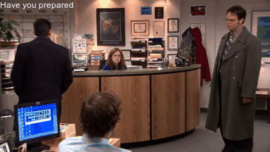

<blockquote class="blockquote">
    <p class="mb-0"><i>Oh, it is on, like a prawn who yawns at dawn.</i></p>
    <p style="text-align:right;">- Andy Bernard</p>
    <center></center>
</blockquote>
    

## Prepare the sitcom
>`PrepDB.ipynb`
### Structure

```
TV Show Name
│
└───Season 1
│   │───Episode 1.mp4
│   │───Episode 2.mp4
│   │   ...
│   │───Episode 24.mp4
│   │───Episode 1.srt
│   │───Episode 2.srt
│   │   ...
│   │───Episode 24.srt
│   
└───Season 2
│   │   ...
│   
└───Season 3
...
```


1. We don't really need any specific file nomenclature. Only that each season's folder has alphabetical video files and alphabetical subtitle files.
2. Put all these season folders into one 'Sitcom Name' folder



I've use `.mp4` and `.srt` here, but they can be other formats too.

The first cell in `PrepDB.ipynb` simply reads the names of these files. The rest of this notebook reads individual subtitles, cleans them and then streams them into BigQuery line-by-line.

3 episodes in the GIF above were about 45,000 rows/subtitles.

 BigQuery table schema


---

# Ask for the GIF
>`MakeGIF.ipynb`
1. Just set the variable name `selected_dialogue` as the word/dialog you want to search for.
2. You will be asked which dialog you want to base your GIF on.


3. Based on your selection and its corresponding timestamps, a video is cut, the text is overlayed and the gif is saved.


<iframe width="560" height="315" src="https://www.youtube.com/embed/btR2OAGXCCU" frameborder="0" allow="accelerometer; autoplay; encrypted-media; gyroscope; picture-in-picture" allowfullscreen></iframe>

---

# Ask for it on your mobile! 📲

Check out `jeevz.py` where I made a chat bot to ask for GIFs!


I used [this](https://www.youtube.com/watch?v=5nhdxpoicW4) and [this](https://pypi.org/project/telegram-send/) to make the chatbot. You should probably write your own, mine breaks easily.


---

## Future Scope
These are easy enough to offer:
* You can make a GIF that includes subtitles adjacent to each other too
* Subtitles are sometimes a few seconds out of sync. Offer a simple +/- 3 seconds option for the video
* Edit the subtitle to a custom text?

--> Also, in BigQuery, implement a UDF for Levenshtein distance/ Cosine similarity so that the user need not remember it word for word


### Making this accessible for all
Any cloud based solution will basically need episodes available online to be downloaded ino an execution env
* Upload the seasons to GCS/ YouTube (Unlisted)
* Turn this into a Colab notebook (thus avoiding data cost/time in downloading the whole episode from where GIF is to be picked)
* Maybe even break each episode into small ¬5MB chunks and upload so that user running notebook locally does not have large UL/DL cost.


