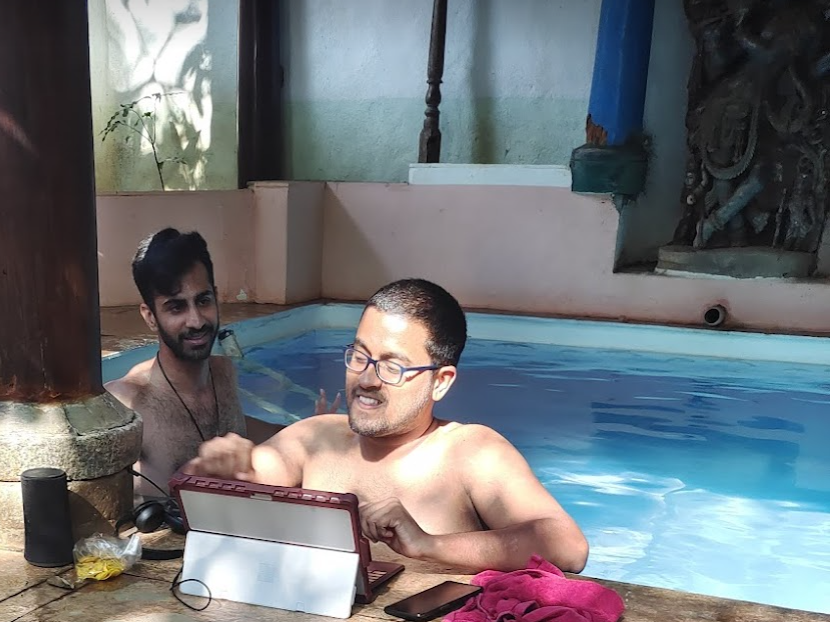
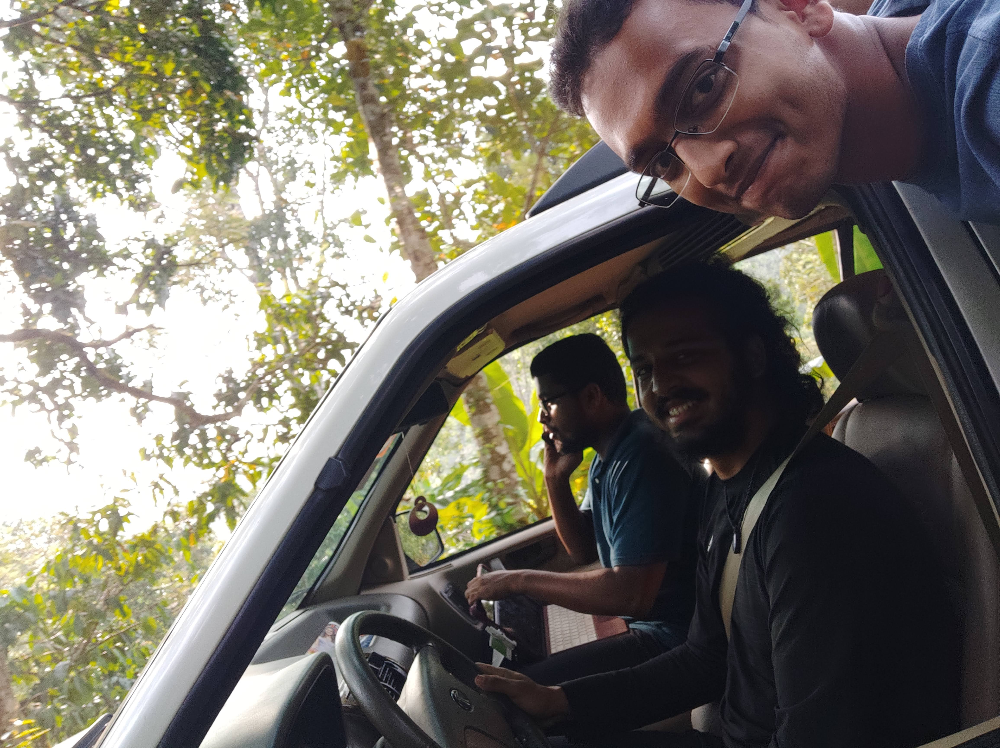
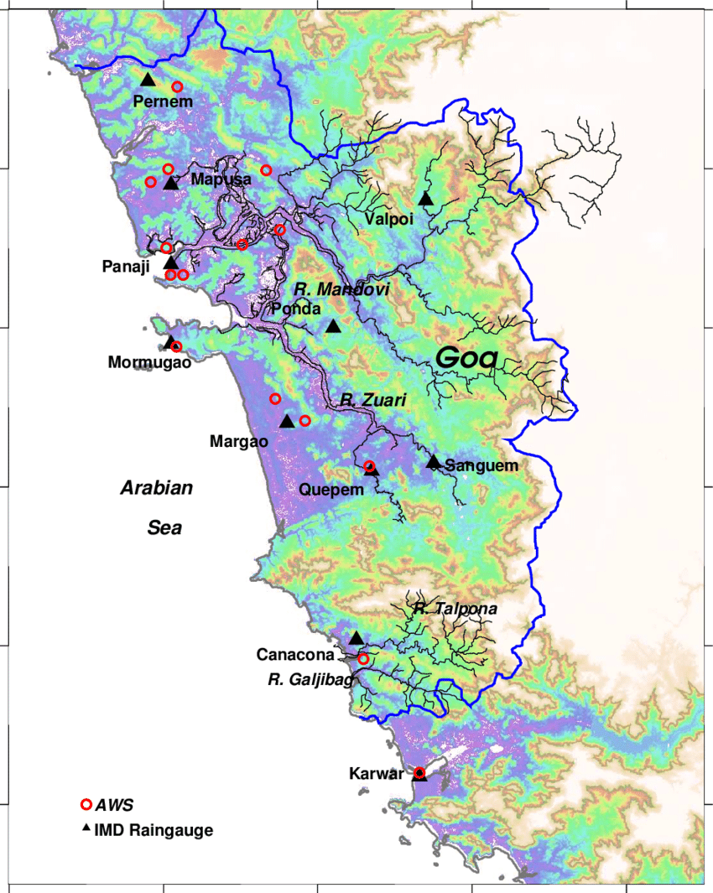

> Ever been afraid of whether you'd be able to connect to the internet while travelling?

{:width="30%"}
{:width="30%"}
<video muted autoplay controls width="22%"> <source src="mobile_data_map_images/coorg_wfh1.mp4"></video>
Images: Me working from a pool, from a car, and from a coffee estate with various levels of success.

Now imagine you had a view of your destination like this:
{:width="60%"}
- The heat map represents the various internet speeds.
- This would be a map for one service provider (say Airtel). You'll be able to toggle between other service providers too (like VI, Jio).

How will it work?
- Crowd sourcing: Every person who has the app will be passively reporting anonymized data of their network providers strengths. Think of it like TrueCaller, but for mobile data.

Use cases:
- People travelling who are relying on their mobile data/hotspot
- People looking to get a new network provider (moving to a new city, dissatisfied with your current service)

Monetization:
- Freemium:  View the map of your service provider for free, but need to pay to view the maps of other service providers.
- Sell the data to network providers (and other interested parties) who can use it as a validation of their coverage strategy and for competitive analysis.
- Channel network provider onboarding through the app. Eg: Use the app to see the best provider in Noida sector, 62 and then directly connect to its registration page. The app can probably assist with mobile number portability too.
- Integration with travel/residential websites like Booking.com, Apartments.com where the stregth of mobile data at the property's location can be authentically provided.

Competitive research
- There are a couple of apps for this on google play store. They are a technical proof of concept.
- However, they were wrongly timed i.e before the proliferation of 4G and Jio in India, and have low quality UX.

Future outlook:
- 5G is amazing, speeds in Gbps! However, **5G's main handicap is the need for proximity**. Hence, such an app will be critical to evaluate what you can really expect from 5G in your neighbourhood.
- Starlink aspires to launch 12,000 satellites, providing the entire world with internet access. With its key beneficiary being people in rural areas who do not have access to traditional broadband infrastructure. This app could provide user-fed data forthe  starlink network too.