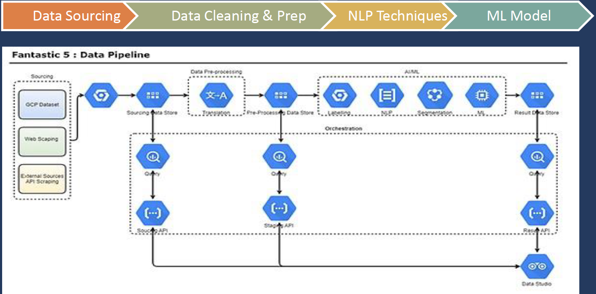

# Finding rich-ass people for private banking and wealth management businesses of big banks
This was a team project for the FoB Hackathon 2020, ML Challenge. We were a group of 5.

## The Use Case
- HNIs are defined as individuals having net worth of > 5 million USD. These high profile individuals are still significant in number and are often in need of wealth management for their businesses or family offices.
- Create an AI/ML based platform to enable identification of potential prospects for Wealth Management leveraging News & Social Analytics.
- Using NLP & Clustering Techniques to identify topics of interests for a group of prospects
- Profiling the prospects using Publicly Available Social Media Data.
- Identify the Degree of Affinity of the prospects to the Trends.

<s>## Demo application - https://datastudio.google.com/s/qRyMPSH5YFQ</s>

## The ML Motivation
- Utilize the affluence of data & soaring social footprints of wealth creators, machine learning can be the motive force to gauge Social, Cognitive, Behavioural & Cultural elements of individuals who could be our future prospects.
- Drastically reduce the manual task of identification, analysis, profiling and segmentation of the leads generated.

{: margin-left:85px" width="80%" }
{: margin-left:85px" width="80%" }
{: margin-left:85px" width="80%" }
{: margin-left:85px" width="80%" } 

## The Data Strategy
- Global Knowledge Graph (GKG): Starting point to filter data as per time series, countries, themes, etc eventually
- Data Segmentation: Confirm data metrics, data scale-up and segment variable definition. followed by Profiling and interpretation.
- Profiling: Building a profile map and perform social and news analytics
- Network Graph: Networkx – Network Cascading Algorithm to simulate link associations in the network graph of prospects that have a social or business connection and a potential lead.
- LinkedIn, Wikipedia, Twitter and Instagram were used for profiling and key-value extraction. 

## The ML Model
- NLP : Stop Word Removal, Tokenisation, Stemming, Lemmatisation, N-Gram Modelling, TF-IDF to find out high-frequency n-grams
- Latent Dirichlet Allocation (LDA): Generative statistical model that allowed us to use sets of observations in order to explain similar parts of data by unobserved groups thus facilitating Topic Modelling.

## The Pipeline
{: margin-left:85px" width="60%" }

A loooot more could have ben done. Here are some of our half baked ideas: 
<iframe src="https://docs.google.com/spreadsheets/d/e/2PACX-1vRLgVwqxvfwdTPAbQPXJ8V3sk50lQP8rRL5pg4c2cDnU9O6JmM1rk3k9qdI46GfDU8JZ9rAGEckOPtp/pubhtml?gid=0&amp;single=true&amp;widget=true&amp;headers=false" width="1160" height="550"></iframe>

[Inspiration](https://databricks.com/notebooks/esg_notebooks/01_esg_report.html) for LDA topic modelling. See Stages 1-3. 
<a href="https://github.com/mukut03/ESG-BERT" target="_blank">BERT ESG</a>
