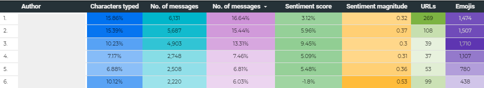
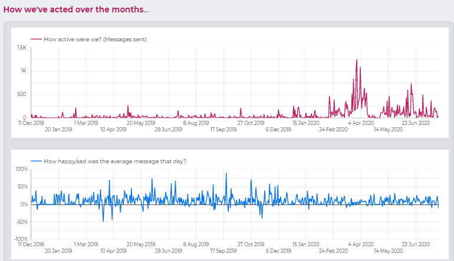
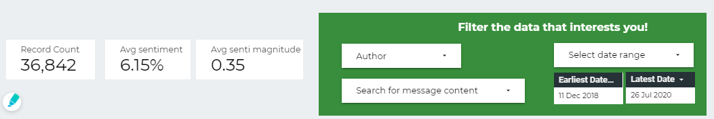

<!-- # Whatsapp group chat analytics -->
This notebook takes your Whatsapp group chat and parses all the messages to show interesting insights.
### This is just a preview. Check out the full product *[here](https://datastudio.google.com/reporting/d1a94683-9b57-4b6d-9282-ed31ac9cec04)*

<iframe width="90%" height="750" src="https://datastudio.google.com/embed/reporting/d1a94683-9b57-4b6d-9282-ed31ac9cec04/page/4VxZB" frameborder="0" style="border:0" allowfullscreen></iframe>

<!-- <lottie-player src="https://assets3.lottiefiles.com/packages/lf20_i0pPw5.json"  background="transparent"  speed="1"  style="width: 300px; height: 300px; text-align:right;"  loop  autoplay></lottie-player> -->

* It breaks up messages by group members

* Analyzes sentiment of messages (and ofc at an aggregate level too)
* Provides time-based analysis of conversation volumes and emotions (_using google's industry standard  cloud NLP API_)

* Seperates out emojis used
* Seperates out individuals _tagged_ in messages
* Handle emoticons and common contractions

### What you need to run it yourself:
* A python/jupyter installation (run the `.py`/ `.ipynb` file respectively) or you can simply use an online tool like [Colab](http://colab.research.google.com/).
* A google cloud account setup. Use this [basic intro of GCP components](https://github.com/swahareddy/IndianMediaNegativity/blob/master/gcp_guide.md) and then follow [these steps](https://cloud.google.com/natural-language/docs/setup) (till 'use key in your env') if you are new to GCP.

## Input format

Export chats from Whatsapp mobile application. This will give you a file with a name like `WhatsApp Chat with Sushil Khairnar.txt`

 

> 17/06/20, 20:05 - Aditya Daftari Coep: <Media omitted>
> 
> 17/06/20, 20:05 - Sim-rum Melvani: Hahaha feels like ages ago
> 
> 17/06/20, 20:06 - Aditya Daftari Coep: Yes 😂
> 
> 17/06/20, 20:06 - Sim-rum Melvani: Kya photo hai😂
> 
> 17/06/20, 20:07 - Aditya Daftari Coep: <Media omitted>
> 
> 17/06/20, 20:07 - Aditya Daftari Coep: Sponge Bob with the sponge ball😂
> 
> 17/06/20, 20:07 - Anoushka Kundu: 😂😂😂😂 look at his fists
> 
> 17/06/20, 20:07 - Aditya Daftari Coep: 😂
> 
> 17/06/20, 20:07 - Anoushka Kundu: SonjBob
> 
> 17/06/20, 20:08 - Aditya Daftari Coep: No
>
> 17/06/20, 20:08 - Aditya Daftari Coep: Sponge Bob bhi bolte the hum 😂
>
> 17/06/20, 20:08 - Anoushka Kundu: But there lies an opportunity to call him sonjbob 😂

## Comments  
> The cleaned message is the one sent to Google's natural language API for classification. Thus, that's what sentiment score and magnitude are based on.  
_Cleaned message + (Links + Emoticons + Emojis* + Tagged people + Garbage characters) = Original message_
*Emojis are conected to their text equivalent in the cleaned message. Eg: 😓 --> downcast_face_with_sweat

* Removed system messages like _'..has left the group', '.. changed the description', '.. changed the group icon'_ etc..
* Ignored `<media ommitted>` that corresponds to images ad GIFs
* Extract URLs, emojis, emoticons from message. 

## Future scope
* _Tagged_ members are mentioned by mobile number. Eg `Hey @919167023114, are you going for the party?`. A simple function to map this number to your mobile's contacts [(export as csv)](https://contacts.google.com/) can reveal name of the person and provide another interesting dimension to the analysis about who tags whom etc.

## Limitations
* Whatsapp does not provide _'reply context'_. i.e. if a message B is in a repsonse to message A, there is no information about this in the `.txt` that you can export.
* Only recent media can be exported. Cannot perform straightforward analysis of media. (Might need to export directly from Whatsapp's mobile storage) and tie it up with `chat.txt`.
* A significant number of messages are _hindi_ words described in English. These cannot be analysed for sentiment (Although if this can be converted into devnagiri script, then it is easily possible)
